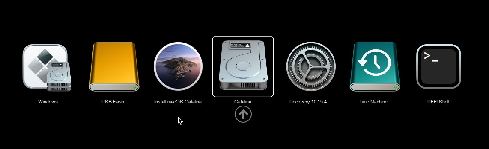
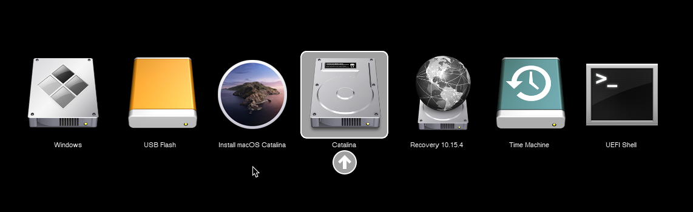
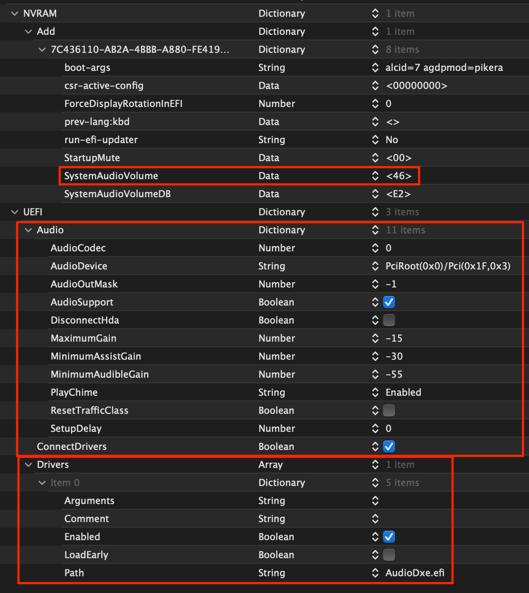

# OpenCore beauty treatment

Main thing this guide will go over:

* [Setting up OpenCore's GUI](#setting-up-opencores-gui)
* [Setting up a boot-chime](#setting-up-boot-chime-with-audiodxe)

## Setting up OpenCore's GUI

So to get started, we're gonna need 0.5.7 or newer as these builds have the GUI included with the rest of the files. If you're on an older version, I recommend updating: [Updating OpenCore](../universal/update.md)

Once that's done, we'll need a couple things:

* [Binary Resources](https://github.com/acidanthera/OcBinaryData)
* [OpenCanopy.efi](https://github.com/acidanthera/OpenCorePkg/releases)
  * Note: OpenCanopy.efi must be from the same build as your OpenCore files, as mismatched files can cause boot issues

Once you have both of these, we'll next want to add it to our EFI partition:

* Add the [Resources folder](https://github.com/acidanthera/OcBinaryData) to EFI/OC
* Add OpenCanopy.efi to EFI/OC/Drivers


Now in our config.plist, we have 4 things we need to fix:

* `Misc -> Boot -> PickerMode`: `External`
* `Misc -> Boot -> PickerAttributes`: `17`
  * This enables mouse/trackpad support as well as .VolumeIcon.icns reading from the drive, allows for macOS installer icons to appear in the picker
    * Other settings for PickerAttributes can be found in the [Configuration.pdf](https://github.com/acidanthera/OpenCorePkg/blob/master/Docs/Configuration.pdf)
* `Misc -> Boot -> PickerVariant`: `Acidanthera\GoldenGate`
  * Applicable variables:
    * `Auto` — Automatically select one set of icons based on DefaultBackground colour.
    * `Acidanthera\Syrah` — Normal icon set.
    * `Acidanthera\GoldenGate` — Nouveau icon set.
    * `Acidanthera\Chardonnay` — Vintage icon set.
* `UEFI -> Drivers` and add OpenCanopy.efi

Once all this is saved, you can reboot and be greeted with a true Mac-like GUI:

| Default (Syrah) | Modern (GoldenGate) | Old (Chardonnay) |
| :--- | :--- | :--- |
|  |  |  |

## Setting up Boot-chime with AudioDxe

So to start, we'll need a couple of things:

* Onboard audio output
  * USB DACs will not work
  * GPU audio out is a hit or miss
* [AudioDxe](https://github.com/acidanthera/OpenCorePkg/releases) in both EFI/OC/Drivers and UEFI -> Drivers
* [Binary Resources](https://github.com/acidanthera/OcBinaryData)
  * Add the Resources folder to EFI/OC, just like we did with the OpenCore GUI section
  * For those running out of space, `OCEFIAudio_VoiceOver_Boot.mp3` is all that's required for the Boot-Chime
* Debug version of OpenCore with logging enabled
  * See [OpenCore Debugging](https://dortania.github.io/OpenCore-Install-Guide/troubleshooting/debug.html) for more info
  * Note: after you're done setting up, you can revert to the RELEASE builds

**Settings up NVRAM**:

* NVRAM -> Add -> 7C436110-AB2A-4BBB-A880-FE41995C9F82:
  * `SystemAudioVolume | Data | 0x46`
    * This is the boot-chime and screen reader volume, note it's in hexadecimal so would become `70` in decimal; `0x80` means muted

Optional
* NVRAM -> Add -> 7C436110-AB2A-4BBB-A880-FE41995C9F82:
  * `StartupMute | Data | 0x00`
    * Mute startup chime sound in firmware audio support; 00 is unmuted, missing variable or any other value means muted

**Setting up UEFI -> Audio:**

* **AudioCodec:** (Number)
  * Codec address of Audio controller. This typically contains the first audio codec address on the builtin analog audio controller (HDEF). Failsafe value is 0.
  * To find yours:
    * Check [IORegistryExplorer](https://github.com/khronokernel/IORegistryClone/blob/master/ioreg-302.zip) -> HDEF -> AppleHDAController -> IOHDACodecDevice and see the `IOHDACodecAddress` property (ex: `0x0`)
    * Can also check via terminal (Note if multiple show up, use the vendor ID to find the right device):

      `sh ioreg -rxn IOHDACodecDevice | grep VendorID   // List all possible devices`
 
      `sh ioreg -rxn IOHDACodecDevice | grep IOHDACodecAddress // Grab the codec address`
 
* **Audio Device:** (String)
  * Device path (PciRoot) of audio controller
  * Run [gfxutil](https://github.com/acidanthera/gfxutil/releases) to find the path:
    * `/path/to/gfxutil -f HDEF`
    * ex: `PciRoot(0x0)/Pci(0x1f,0x3)`

* **AudioOutMask:** (Number)
  * Play sound in UEFI to more than one channel (e.g. main speaker plus bass speaker). Failsafe value is `-1` (output to all).
  * Output channels are internally numbered as bit `0` (value `1`), bit `1` (value `2`) and so on. A value of `1` refers to the first audio output (not necessarily main speaker). A value of `-1` is used to play to all channels simultaneously.
  * When AudioSupport is enabled, AudioDevice must be either empty or a valid path and AudioOutMask must be non-zero
  * Easiest way to find the right one is to go through each one (from 0 to N - 1, where N is the number of outputs listed in your log); ex: 5 outputs would translate to 0-4 as possible values
  * You can find all the ones for your codec in the OpenCore debug logs:

    ```
    06:065 00:004 OCAU: Matching PciRoot(0x0)/Pci(0x1F,0x3)/VenMsg(A9003FEB-D806-41DB-A491-5405FEEF46C3,00000000)...
    06:070 00:005 OCAU: 1/2 PciRoot(0x0)/Pci(0x1F,0x3)/VenMsg(A9003FEB-D806-41DB-A491-5405FEEF46C3,00000000) (5 outputs) - Success
    ```
* **AudioSupport:** (Boolean)
  * Set this to `True`
  * Enabling this setting routes audio playback from builtin protocols to specified dedicated audio ports (AudioOutMask) of the specified codec (AudioCodec), located on the specified audio controller (AudioDevice)

* **DisconnectHDA:** (Boolean)
  * Set this to `False`

* **MaximumGain:** (Number)
  * Maximum gain to use for UEFI audio, specified in decibels (dB) with respect to amplifier reference level of 0 dB
  * Set this to `-15`

* **MinimumAssistGain:** (Number)
  * Minimum gain in decibels (dB) to use for picker audio assist. The screen reader will use this amplifier gain if the system amplifier gain read from the SystemAudioVolumeDB NVRAM variable is lower than this
  * Set this to `-30`

* **MinimumAudibleGain:** (Number)
  * Minimum gain in decibels (dB) at which to attempt to play any sound
  * Set this to `-55`

* **PlayChime:** (String)
  * Set this to `Enabled`
  * Supported values are:
    * Auto — Enables chime when StartupMute NVRAM variable is not present or set to 00
    * Enabled — Enables chime unconditionally
    * Disabled — Disables chime unconditionally

* **ResetTrafficClass:** (Boolean)
  * Set this to `False`

* **SetupDelay:** (Number)
  * By default, leave this at `0`
  * Some codecs many need extra time for setup, we recommend setting to `500` milliseconds (0.5 seconds) if you have issues

Once done, you should get something like this:



**Note about audio codec default sampling rate**:

There are codecs like Realtek ALC295 (HP and others) whose default audio sampling rate is 48 kHz. In this case, even if 44.1 kHz is supported by the codec, audio chime fails and does not sound. The only way at the moment to fix this is to modify the `OCEFIAudio_VoiceOver_Boot.mp3` sample rate with an audio editor to raise it from 44.1 kHz to 48 kHz. This has to be done by the end user as OpenCore does not have an automated mechanism for it.

**Note for visually impaired**:

* OpenCore hasn't forgotten about you! With the AudioDxe setup, you can enable both picker audio and FileVault VoiceOver with these 2 settings:
  * `Misc -> Boot -> PickerAudioAssist -> True` to enable picker audio
  * `UEFI -> ProtocolOverrides -> AppleAudio -> True` to enable FileVault voice over
* See [Security and FileVault](../universal/security.md) on how to setup the rest for proper FileVault support.
