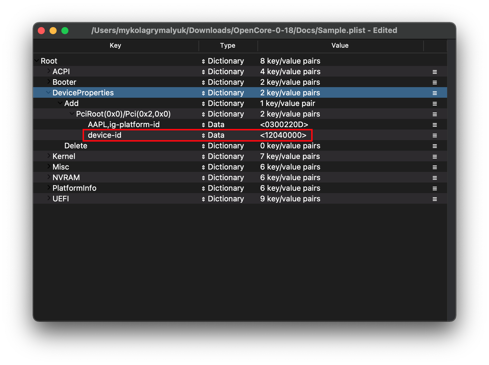

# Intel iGPU Patching

This guide will be a more in-depth look into patching macOS to support more hardware variations of Intel's iGPUs including proper display out, fixing color tint issues, HiDPI issues and etc. Note this guide is **not** a beginners tutorial, we recommend you follow the recommend iGPU properties listed in the config.plist section of the guide to start off.

This guide supports:

* Sandy Bridge through Ice Lake iGPUs

## Terminology

| Term | Description |
| :--- | :--- |
| Framebuffer | Refers to the kext used in macOS to drive a GPU |
| Framebuffer Profile | Profile in a framebuffer which determines how the iGPU will act |
| WhateverGreen | Kext used to patch GPU drivers to better support PC hardware |
| AAPL,ig-platform-id | Property used by macOS to determine the framebuffer profile with Ivy Bridge and newer |
| AAPL,snb-platform-id | Property used by macOS to determine the framebuffer profile with Sandy Bridge |
| device-id | Used by IOKit to match hardware to kexts |

## Getting started

Before we jump too deep into this rabbit hole, we should first explain what we're doing and why we need to do this.

**Basic topics**:

* [AAPL,ig-platform-id explainer](#aapl-ig-platform-id-explainer)
* [device-id explainer](#device-id-explainer)

### AAPL,ig-platform-id explainer

By default in Macs with iGPUs, there are a few configurations:

* iGPU is the sole display output
  * Commonly seen on Mac Minis, MacBook Airs, 13" MacBook Pros and iMacs without a dGPU
* iGPU is only used for internal displays, and dGPUs are handling external displays
  * Commonly seen with 15" MacBook Pros
* iGPU is solely used for internal compute, and dGPU handles all display outputs
  * Commonly seen with iMacs that include dGPUs

The reason why this is important is due to the amount of iGPU configurations Apple supports in the iGPU kexts, specifically known as framebuffer personalities. These personalities determine many things including number of displays, types of displays allowed, location of these displays, minimum VRAM required, etc, and so we need to either hope one of these profiles matches our hardware or try to patch it.

To specify a framebuffer personality in macOS, we use the DeviceProperties section in OpenCore to add an entry called `AAPL,ig-platform-id`

* Note: on Sandy Bridge, we use `AAPL,snb-platform-id` instead

The format of this entry is hexadecimal, and is byte swapped from the actual value. A full list of these values can be found in WhateverGreen's manual: [FAQ.IntelHD.en.md](https://github.com/acidanthera/WhateverGreen/blob/master/Manual/FAQ.IntelHD.en.md)

For this example, lets try to find a framebuffer compatible for a desktop HD 4600 iGPU. We'll first want to scroll down the manual until we hit the [Intel HD Graphics 4200-5200 (Haswell processors)](https://github.com/acidanthera/WhateverGreen/blob/master/Manual/FAQ.IntelHD.en.md#Intel-hd-graphics-4200-5200-haswell-processors) entry. Here we're given a list of all supported framebuffers in macOS, including the hardware type(ie. Mobile vs desktop), VRAM requirements, etc. If you scroll to the bottom of this list, you're also given some recommended options:

```
Desktop :
 0x0D220003 (default)
Laptop :
 0x0A160000 (default)
 0x0A260005 (recommended)
 0x0A260006 (recommended)
Empty Framebuffer :
 0x04120004 (default)
```

The first 2 entries are pretty obvious, however the last one(Empty Framebuffer) refers to systems where they have a dGPU already setup but still have an iGPU enabled in the background to handle tasks such as hardware accelerated decoding in tasks it excels at.

Now since we're using the desktop HD 4600, we'll grab the corresponding framebuffer profile: `0x0D220003`

Now by itself, we cannot use this in our config.plist. The reasoning being is that it's in Big Endian while macOS's IOService tree expects it to be in Little Endian. To convert it however is quite simple:

```md
# To start, remove the 0x and then space them out in pairs
0x0D220003 -> 0D 22 00 03

# Next, reverse the order but keep the pairs together
0D 22 00 03 -> 03 00 22 0D

# And now you have your final framebuffer profile
0300220D = AAPL,ig-platform-id
```

From here, lets open up our config.plist and head to DeviceProperties -> Add. Now we'll want to add a new Entry called `PciRoot(0x0)/Pci(0x2,0x0)`. This is the location of Intel's iGPUs relative to the IOService path, and has been consistent as far back as Yonah series CPUs(2007+):

| Key | Type | Value |
| :--- | :--- | :--- |
| AAPL,ig-platform-id | Data | 0300220D |


### device-id explainer

`device-id` is what macOS, or more specifically IOKit, uses to determine which devices are allowed to connect to which drivers. Why this is important for us is that Apple's iGPU drivers have a limited amount of IDs even though the kext itself can support much more.

To determine whether you need a new `device-id` injected, you'll want to compare [WhateverGreen's list of supported IDs](https://github.com/acidanthera/WhateverGreen/blob/master/Manual/FAQ.IntelHD.en.md) to what you have.

For this example, lets take a look at the i3-4150 with an HD 4400 iGPU. Using [Intel's ARK page](https://ark.Intel.com/content/www/us/en/ark/products/77486/Intel-core-i3-4150-processor-3m-cache-3-50-ghz.html), we can see the following:

```
Device ID = 0x41E
```

Now that we have our actual Device ID, lets compare it to [WhateverGreen's list](https://github.com/acidanthera/WhateverGreen/blob/master/Manual/FAQ.IntelHD.en.md):

```
Native supported DevIDs:

 0x0d26
 0x0a26
 0x0a2e
 0x0d22
 0x0412
```

Unfortunately the ID is not present in macOS, so we'll need to find a similar iGPU to ours and use their Device ID. The HD 4600 found in the [i3-4330](https://ark.Intel.com/content/www/us/en/ark/products/77769/Intel-core-i3-4330-processor-4m-cache-3-50-ghz.html) is a very close match, so we'll use its Device ID:

```
Device ID = 0x412
```

However, by default this cannot be injected. We'll need to first pad it to 8 bits and hex swap:

```md
# First, remove 0x and pad it to 8 bits by using 0's in front of it
0x412 -> 00 00 04 12

# Next reverse it, but keep the pairs in tact
00 00 04 12 -> 12 04 00 00

# And voila, you have your device-id
12040000 = device-id
```

Now that we have our device-id, we'll do the same thing as before with ig-platform-id. Open your config.plist and add this new entry under `PciRoot(0x0)/Pci(0x2,0x0)`:

| Key | Type | Value |
| :--- | :--- | :--- |
| device-id | Data | 12040000 |



## Learning to patch with WhateverGreen

Now that we've gone over the basics of setting up an iGPU, let's get into some deeper topics. We'll need to go over some  prerequisites first:

* Lilu and WhateverGreen are present under EFI/OC/Kexts and in your config.plist
  * To verify if they loaded correctly in macOS, run the below command(if nothing is outputted, the kexts are not loading)
  * `kextstat | grep -E "Lilu|WhateverGreen"`
* `DeviceProperties -> Add -> PciRoot(0x0)/Pci(0x2,0x0)` has been correctly setup
  * Refer to your specific generation in the [config.plist section](https://dortania.github.io/OpenCore-Install-Guide/)

Now head forth into your framebuffer patching journey!:

* [Patching the VRAM requirement of macOS](./vram.md)
  * Relevant for systems with locked BIOS and cannot increase the VRAM
* [Patching the display type](./connector.md)
  * Relevant for systems where you may get distorted colors on certain monitors
* [Patching the display connections](./busid.md)
  * Relevant for systems where certain display outputs do not work


## Potential fix for DP audio output
If you are using iGPU only with DP cable, display is working but no audio output to the monitor, try inject the edid ID using hackintool or other methods. Might be a fix for you.
