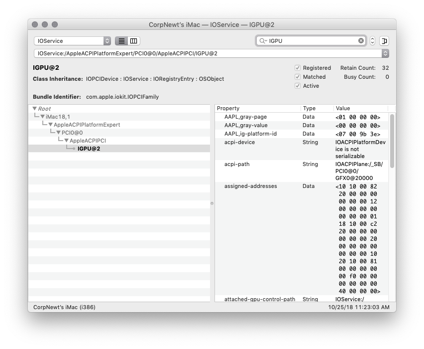
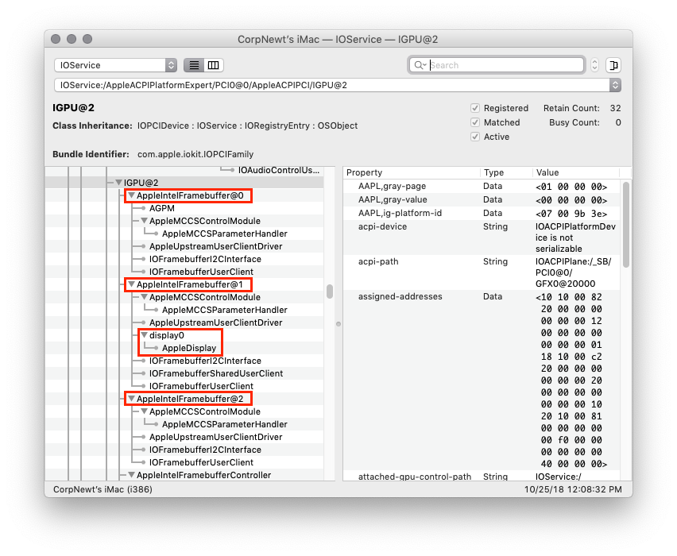
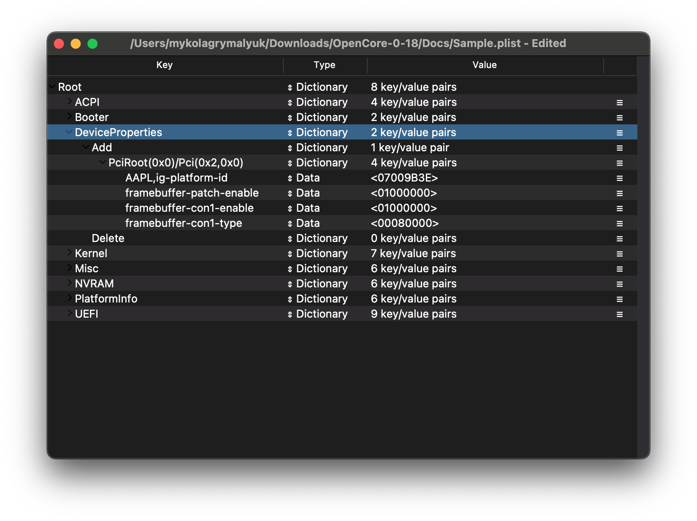

# Patching Connector Types

* Images and info based on [CorpNewt's Vanilla Guide](https://hackintosh.gitbook.io/-r-hackintosh-vanilla-desktop-guide/config.plist-per-hardware/coffee-lake#pink-purple-tint)

This section is mainly relevant for users who either get a black screen or incorrect color output on their displays(usually HDMI ports). This is due to Apple forcing display types onto your hardware,. To work around it, we'll patch Apple's connector types to properly respect our hardware.

For this example, let's take a UHD 630 system with an HDMI display attached. The machine has already been correctly setup however there's a Pink/Purple tint on the HDMI display.

Grab a copy of [IOReg](https://github.com/khronokernel/IORegistryClone/blob/master/ioreg-302.zip) and search for the `iGPU` entry:



Next, clear out the entry so we can see the children of the iGPU device:



As we can see in the above screenshot, we have a few framebuffer entries listed. These are all display personalities present in the framebuffer personality, and all have their own settings.

For us, we care about the entries that have a `display0` child, as this is what's driving a physical display. In this example, we can see it's `AppleIntelFramebuffer@1`. When we select it, you'll see in the left pane it has the property `connector-type` with the value `<00 04 00 00>`. And when we look to the below list:

```
<02 00 00 00>        LVDS and eDP      - Laptop displays
<10 00 00 00>        VGA               - Unsupported in 10.8 and newer
<00 04 00 00>        DisplayPort       - USB-C display-out are DP internally
<01 00 00 00>        DUMMY             - Used when there is no physical port
<00 08 00 00>        HDMI
<80 00 00 00>        S-Video
<04 00 00 00>        DVI (Dual Link)
<00 02 00 00>        DVI (Single Link)
```

* Note: VGA on Skylake and newer are DisplayPorts internally and so are supported by macOS. Please use the DisplayPort connector for these systems.

Looking closer, we see that the HDMI port was actually listed as a DisplayPort. This is where WhateverGreen's patching mechanisms come into play.

Since the incorrect port was located at AppleIntelFramebuffer@1, this is port 1. Next we'll to enable WhateverGreen's patching mechanism for con1, and then set the connector type to HDMI. To do this,  we set the following Properties under `DeviceProperties -> Add -> PciRoot(0x0)/Pci(0x2,0x0)`:

* `framebuffer-patch-enable = 01000000`
  * Enables WhateverGreen's patching mechanism
* `framebuffer-conX-enable = 01000000`
  * Enables WhateverGreen's patching on conX
* `framebuffer-conX-type = 00080000`
  * Sets the port to HDMI(`<00 08 00 00>`)

Note: Remember to replace the `conX` in both patches with `con1` to reflect the port that we want fixed, then set the values as listed above.


