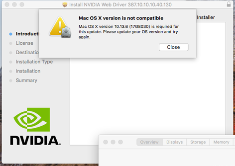

# Nvidia Web Drivers

Modern Nvidia GPUs (900+ series) require little patching, if any at all. Most should generally just work out of the box with Nvidia Web Drivers.

To start off, we'll be assuming the following:

* macOS has already been installed in some way and is on the latest security update
  * This is **super** important, the Nvidia Web Drivers check the macOS version and will not work on older versions
* Your GPU is either Maxwell or newer
  * Kepler does not need any web drivers
* Lilu and WhateverGreen are loaded
  * verify by running `kextstat | grep -E "Lilu|WhateverGreen"`

To install the Nvidia Web Drivers, you'll want to download the [latest version from Nvidia](https://www.insanelymac.com/forum/topic/324195-nvidia-web-driver-updates-for-macos-high-sierra-update-nov-13-2020/).

Run the package, and then restart your computer. You should be running the web drivers.

Note that if you run into a message such as what is shown below, you need to update your macOS through the app store.  
  

## Updating macOS

If you end up doing any security updates, keep in mind that the Nvidia Web Drivers will not always be available imediately after an update comes out. Generally it's best to wait a day and make sure that a new Web Driver has been released before updating - otherwise it will revert to the default drivers.

## Patching Web Drivers to Run on Other macOS Versions

This is generally *not* recommended, and this will **not** allow Web Drivers to work in macOS 10.14+.

Whatevergreen can automatically patch out the compatibility check with the boot argument `ngfxcompat=1`.  
Additionally, you can attach the following device property to your GPU:

| Name | Type | Value |
| :--- | :--- | :---- |
| force-compat | Data | 01 | the property `force-compat` set as Data, `01 00 00 00` to ignore the check when you have Whatevergreen.