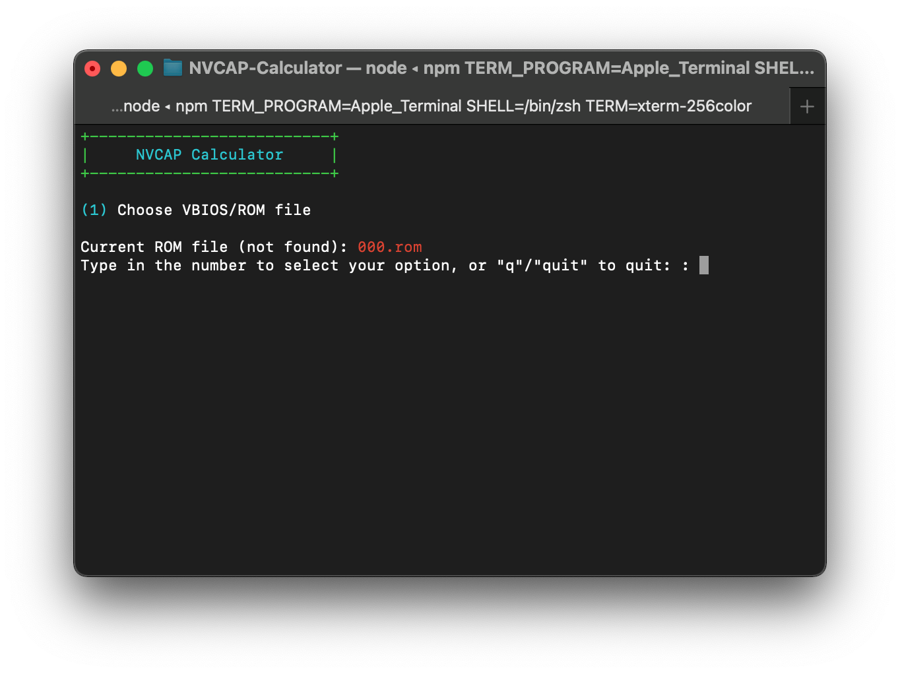
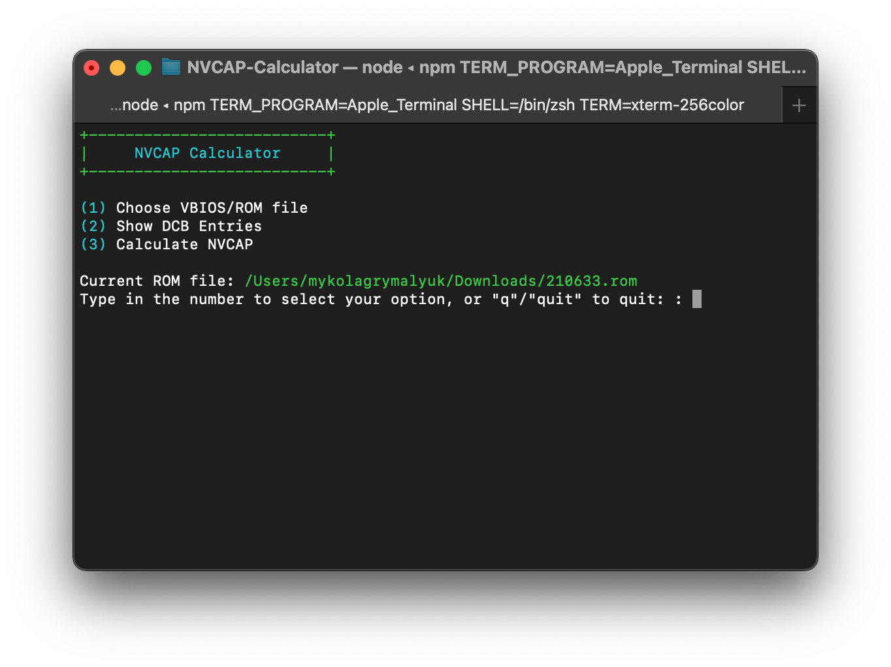

# Legacy Nvidia Patching

* Please note this page is more of an info dump, we won't be ging to too great of detail on setup though we plan to expand this page more for it.


With legacy Nvidia GPUs, macOS has difficulties enabling acceleration due to many missing properties. To work around this, we can inject properties into IOService for macOS to easily interpret.

To start off, we'll be assuming the following:

* macOS has already been installed in some way
  * We need macOS installed to determine certain properties
* Your GPU is either Fermi or older
  * Kepler and newer **do not** need Device Property injection
* Lilu and WhateverGreen are loaded
  * verify by running `kextstat | grep -E "Lilu|WhateverGreen"`
  
  
### Finding the GPU pathing

First lets grab [gfxutil](https://github.com/acidanthera/gfxutil/releases) and run the following:

```
path/to/gfxutil -f display
```


This should spit out something like the following:

```
67:00.0 10DE:0A20 /PC02@0/BR2A@0/GFX0@0/ = PciRoot(0x2)/Pci(0x0,0x0)/Pci(0x0,0x0)/
```

What we care about is the PciRoot section, as this is where our GPU is located and where we'll be injecting our properties:

```
PciRoot(0x2)/Pci(0x0,0x0)/Pci(0x0,0x0)/
```


### Building our DeviceProperties

With Nvidia GPUs, there's actually not too many properties required for setup. The main ones that are recommended are the following:

| Property | Value | Comment |
| :--- | :--- | :--- |
| model | ex. GeForce GT 220 | GPU model name, cosmetic |
| device_type | NVDA,Parent | Always set as `NVDA,Parent` |
| VRAM,totalsize | ex. 0000004000000000 | Sets VRAM size |
| rom-revision | Dortania | Property must exist, however the value can be anything |
| NVCAP | ex. 0500000000000F00000000000000000F00000000 | sets display properties used by macOS, more info below |
| @0,compatible | NVDA,NVMac | Always set as `NVDA,NVMac` |
| @0,device_type | display | Always set as `display` |
| @0,name | NVDA,Display-A | Always set as `NVDA,Display-A` |
| @1,compatible | NVDA,NVMac | Always set as `NVDA,NVMac` |
| @1,device_type | display | Always set as `display` |
| @1,name | NVDA,Display-B | Always set as `NVDA,Display-B` |


And to calculate the properties few properties:

* [model](#model)
* [VRAM,totalsize](#vram-totalsize)
* [rom-revision](#rom-revision)
* [NVCAP](#nvcap)

### model

Technically cosmetic, however macOS expects this entry to we'll provide it. The format is as follows:

```md
GeForce [Device Name]
# Example
GeForce GT 220
```

### VRAM,totalsize

Amount of VRAM present on your card, in hexadecimal.

For this example, lets convert 1024MB to hexadecimal:

```md
# Convert 1024MB Megabytes to Bytes
echo '1024 * 1024 * 1024' | bc
	1073741824

# Convert from decimal to hexadecimal
echo 'obase=16; ibase=10; 1073741824' | bc
	40000000

# Hexswap so it can be injected correctly
# ie. swap in pairs
40000000 -> 40 00 00 00 -> 00 00 00 40

# Pad the value to 8 bytes with 00 at the end
00 00 00 40 00 00 00 00

# And you're done
VRAM,totalsize = 0000004000000000
```

### rom-revision

Simply can be any value, however the property must exist as some GPUs fail to initialise without it(ex. GT 220's)

```
rom-revision = Dortania
```

### NVCAP

This is where the fun comes it, as we'll now need to calculate the NVCAP value. Thankfully for us, one of our Developers has created a tool to automate the process: [NVCAP-Caluclator](https://github.com/1Revenger1/NVCAP-Calculator)

To use this program, simply grab your VBIOS([TechPowerUp hosts most VBIOS](https://www.techpowerup.com/vgabios/)) and run NVCAP-Calculator:


```bash
git clone https://github.com/1Revenger1/NVCAP-Calculator
cd NVCAP-Calculator
npm install
npm run run
```

* Note this will require NPM, either grab this via brew or [Node JS's site](https://www.npmjs.com/get-npm)


Once its running, you should see the following:



Next, enter `1` and give it your VBIOS



Now enter 


For those who are wanting a break down on how to calculate the NVCAP value:

::: details NVCAP Table

Info based off of [WhateverGreen's NVCAP.bt file](https://github.com/acidanthera/WhateverGreen/blob/master/Manual/NVCAP.bt)

| NVCAP Bit | Name | Comment |
| :--- | :--- | :--- |
| Bit 1 | NVCAP Version | `04` for Tesla V1(7 series and older), `05` for Tesla V2(8 series and newer) |
| Bit 2 | Laptop with Lid | `01` for true, `00` otherwise |
| Bit 3 | Composite | `01` for S-Video, `00` otherwise |
| Bit 4 | Backlight | `01` for Tesla V1 with Backlight, otherwise `00` for newer GPUs regardless of screen type |
| Bits 5+6   | TVDCBMask    | `00 00`, relates to DCB entry 5 |
| Bits 7+8   | Head0DCBMask | `00 00`, see below |
| Bits 9+10  | Head1DCBMask | `00 00`, see below |
| Bits 11+12 | Head2DCBMask | `00 00`, non-applicable for Fermi and older |
| Bits 13+14 | Head3DCBMask | `00 00`, non-applicable for Fermi and older |
| Bit 15 | ScriptBasedPowerAndBacklight| `00`, only relevant for genuine MacBook Pros |
| Bit 16 | Unknown | `0F` for 300 series and newer, otherwise `07` |
| Bit 17 | EDID | `00` |
| Bit 18 | Unknown | `00` |
| Bit 19 | Unknown | `00` |
| Bit 20 | Unknown | `00` |

:::