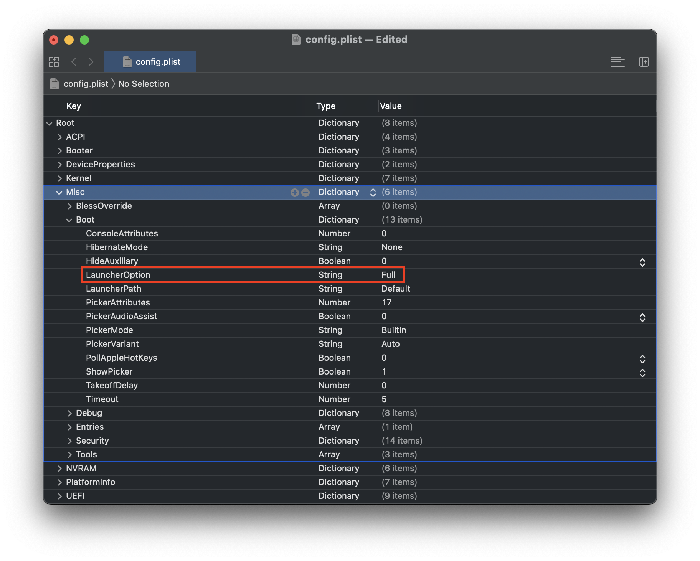

# Using LauncherOption

* Note: With OpenCore 0.6.6, Bootstrap.efi has been replaced with LauncherOption. See here for more info on updating: [Updating Bootstrap in 0.6.6](#updating-bootstrap-in-0-6-6)

With OpenCore 0.6.6 and newer, we are now able to launch OpenCore directly from our firmwares without needing a launcher (Bootstrap.efi or BOOTx64.efi) as an intermediary. This allows us to add OpenCore to our motherboard's boot menu and prevent issues where either Windows or Linux try to overwrite the `EFI/BOOT/BOOTx64.efi` path, which can happen when installing or updating Windows and therefore breaking OpenCore's ability to boot.

## Prerequisites



* [OpenCore 0.6.6 or newer](https://github.com/acidanthera/OpenCorePkg/releases)
  * For 0.6.5 and older users upgrading, see here: [Updating Bootstrap in 0.6.6](#updating-bootstrap-in-0-6-6)
* config.plist settings:
  * `Misc -> Boot -> LauncherOption` = `Full`
    * Use `Short` for Insyde based firmwares, commonly found on laptops
  * `UEFI -> Quirks -> RequestBootVarRouting` = `True`
* [OpenShell](https://github.com/acidanthera/OpenCorePkg/releases)
  * Bundled with OpenCore
  * Remember to add this to both EFI/OC/Tools and `Misc -> Tools`
  * This is mainly for troubleshooting

## Booting

If everything is set up correctly, the first boot will have OpenCore create a new boot option in our BIOS (pointing to `EFI/OC/OpenCore.efi`) and future boots will update the entry making sure it's correct and ensuring it is still present. This now allows us to remove BOOTx64.efi and not worry about other OSes overwriting the `EFI/BOOT/BOOTx64.efi` path.

## Troubleshooting

If no new boot option is created, you can follow these troubleshooting steps but first double-check the prerequisites were met. The following sections are a mini-guide in case LauncherOption doesn't work or you'd like to do it manually.

* [Verify LauncherOption entry was applied](#verify-launcheroption-entry-was-applied)
* [Removing LauncherOption entry from BIOS](#removing-launcheroption-entry-from-bios)

### Verify LauncherOption entry was applied

For those wanting to verify that the entry was applied in OpenCore, enable logging (see [OpenCore Debugging](https://dortania.github.io/OpenCore-Install-Guide/troubleshooting/debug.html)) and check for entries similar to these:

```
OCB: Have existing option 1, valid 1
OCB: Boot order has first option as the default option
```

### Removing LauncherOption entry from BIOS

Because the LauncherOption entry is a protected entry when resetting NVRAM, you'll need to disable `LauncherOption` first before you can remove it:

* `Misc -> Security -> AllowNvramReset -> True`
* `Misc -> Boot -> LauncherOption -> Disabled`

Once these are set, you can reboot into the OpenCore picker and select the `Reset NVRAM` entry to clear your NVRAM, which will remove the LauncherOption entry too..

## Updating Bootstrap in 0.6.6

For those updating to 0.6.6, you may have noticed `Bootstrap.efi` has been removed from OpenCore. This is due to changes with how OpenCore works; specifically OpenCore is now a UEFI application instead of a driver. This means `OpenCore.efi` can be loaded directly and a launcher (Bootstrap.efi) is no longer needed.

### With Bootstrap disabled

If Bootstrap is disabled prior to updating to 0.6.6, you don't need to make any changes, just the usual file swapping. If afterwards you would like to try `LauncherOption`, you can do so with no issues.

### With Bootstrap enabled

If Bootstrap is enabled prior to updating to 0.6.6, and your motherboard's firmware will autodetect `EFI/BOOT/BOOTx64.efi`, you can do the following before you update:

1. Set `Misc -> Security -> AllowNvramReset` to `True` and `Misc -> Security -> BootProtect` to `None`, then reset NVRAM (either outside of or in OpenCore) and boot. This will get rid of the old Bootstrap boot entry.
2. Update your OpenCore setup as normal, ensuring that you copy BOOTx64.efi from the OpenCore package to `EFI/BOOT/BOOTx64.efi` and set `Misc -> Boot -> LauncherOption` in your config.plist to `Full` (or `Short` if previously using `BootstrapShort`).
3. Reboot.

   On first boot you will need to boot from `EFI/BOOT/BOOTx64.efi`, but on subsequent boots you should see the LauncherOption entry created by OpenCore directly booting `OpenCore.efi`.

If your firmware does not automatically detect `EFI/BOOT/BOOTx64.efi` or you cannot put OpenCore's launcher there for any reason, you have multiple other options:

* Put `OpenShell.efi` on a USB, rename and move to `EFI/BOOT/BOOTx64.efi`, and follow the above steps, except insteading of selecting `BOOTx64.efi` from the boot menu, boot into the USB and launch OpenCore from there directly.
* Add a folder `EFI/OC/Bootstrap` and copy and rename BOOTx64.efi from the OpenCore package to `EFI/OC/Bootstrap/Bootstrap.efi`. Then, after updating your OpenCore setup, set `Misc -> Boot -> LauncherOption` to the appropriate option (`Full`, or `Short` if previously using `BootstrapShort`) and boot OpenCore using the existing entry create by Bootstrap. After your first boot, you should see a new OpenCore boot entry added. You can then reset NVRAM in OpenCore (making sure to keep `LauncherOption` enabled so you don't delete the new entry) to get rid of the old Bootstrap boot entry.

Conversion notes:

| 0.5.8 - 0.6.5 | 0.6.6+ |
| :--- | :--- |
| Misc -> Security -> BootProtect | Misc -> Boot -> LauncherOption |
| Bootstrap | Full |
| BootstrapShort | Short |
