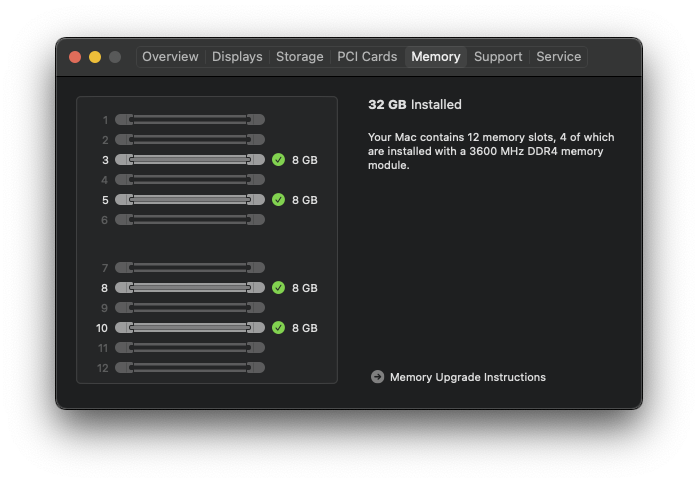

# Presenting four DIMMs to Mac OS correctly

If you have four DIMMs installed on your mainboard, great! 

Your values from using dmidecode (described previously) might be similar to this:

```
### Common values ###
Data Width: 64 bits
Error Correction Type: None
Form Factor: DIMM
MaxCpacity: 824633720832
Total Width: 64 bits
Type: DDR4
Type Detail: Synchronous

### DIMM 1 ###
Asset Tag: Not Specified
Bank Locator: Not Specified
Locator: DIMM 1
Manufacturer: CRUCIAL
Part Number: BLE8G4D36BEEAK.M8FE1
Serial Number: 8899AABB
Size: 8 GB
Speed: 3600 MT/s

### DIMM 2 ###
Asset Tag: Not Specified
Bank Locator: Not Specified
Locator: DIMM 1
Manufacturer: CRUCIAL
Part Number: BLE8G4D36BEEAK.M8FE1
Serial Number: 8899AABC
Size: 8 GB
Speed: 3600 MT/s

### DIMM 3 ###
Asset Tag: Not Specified
Bank Locator: Not Specified
Locator: DIMM 1
Manufacturer: CRUCIAL
Part Number: BLE8G4D36BEEAK.M8FE1
Serial Number: 8899AABD
Size: 8 GB
Speed: 3600 MT/s

### DIMM 4 ###
Asset Tag: Not Specified
Bank Locator: Not Specified
Locator: DIMM 1
Manufacturer: CRUCIAL
Part Number: BLE8G4D36BEEAK.M8FE1
Serial Number: 8899AABE
Size: 8 GB
Speed: 3600 MT/s
```

---

## Edit your OpenCore config.plist file

You will edit your OpenCore EFI config.plist file to enter these values correctly.
Using your favorite plist editor, open the `PlatformInfo` section.
* Set the value of the `CustomMemory` field to `true` (or 1, or YES, depending on your editor).


Under the `PlatformInfo` section there will be a `Memory` section. Open the `Memory` section.

Set the values here using the values you discovered from your physical RAM.

E.G. Using our example data seen above...

`DataWidth` = 64

`ErrorCorrection` = 3

`FormFactor` = 9

`MaxCapacity` = 824633720832

`TotalWidth` = 64

`Type` = 26

`TypeDetail` = 128

> Remember, the `MaxCapacity` value is dependant upon the type of processor fitted to an Apple Mac Pro 7,1. See [Mac Pro (2019) memory specifications](https://support.apple.com/en-gb/HT210405). The value should be one of:

| Max RAM | Expressed as bytes |
|---------|--------------------|
| 768GB | `824633720832` |
| 1.5TB | `1649267441664` |


Under the `Memory` section there will be a `Devices` section. Open the `Devices` section.

We are going to "populate" the 12-slots with four DIMMS. Referring back to [Install and replace memory in your Mac Pro (2019)](https://support.apple.com/en-gb/HT210103?cid=macOS_UI_Memory_article_HT210103) we can see that our four DIMMS need to go into slots 3, 5, 8, and 10.

In the config.plist file Devices section...

| Item number | Is Slot | Referenced as |
|-------------|---------|---------------|
| 0 | is slot 8 | referenced as Channel A / DIMM 1 |
| 2 | is slot 10 | referenced as Channel B / DIMM 1 |
| 6 | is slot 5 | referenced as Channel D / DIMM 1 |
| 8 | is slot 3 | referenced as Channel C / DIMM 1 |


All other items should be "EMPTY" slots.

The important key is the `Manufacturer` key should be set to `NO DIMM` for an empty slot. 

Keys `Size` and `Speed` should both be set to `0` for an empty slot.


Save your config.plist file and reboot your system. If everything goes as planned, the first thing you will notice is the absence of the memory error notification. 

| Fixed System Profiler | Fixed About This Mac |
| :--- | :--- |
|  |  |

