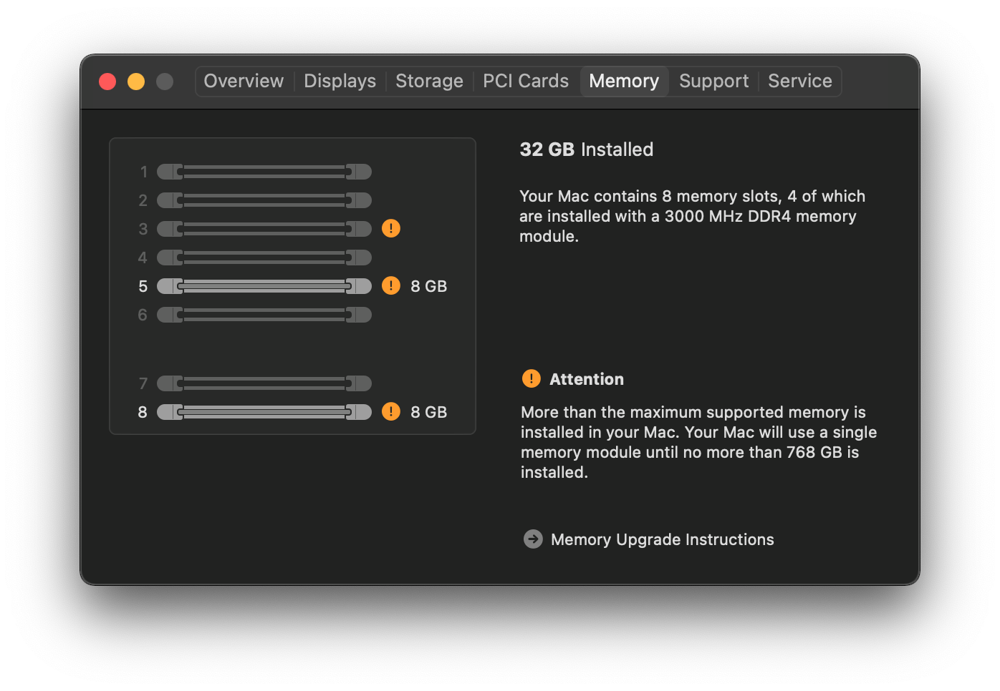
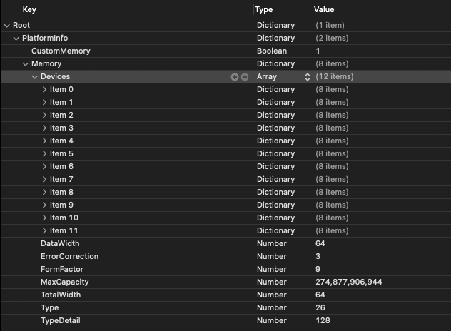
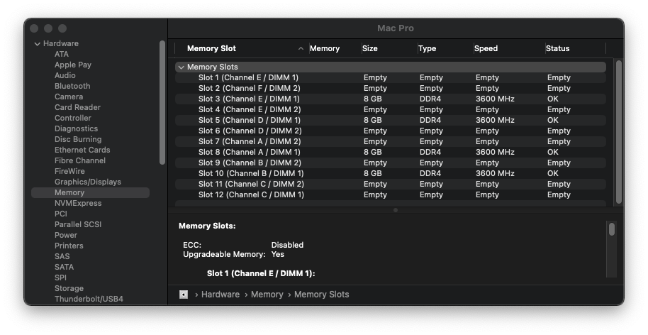
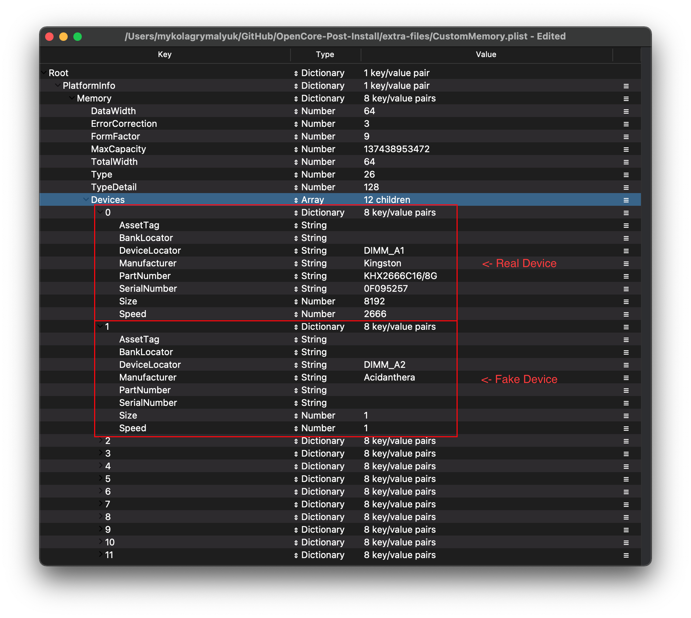
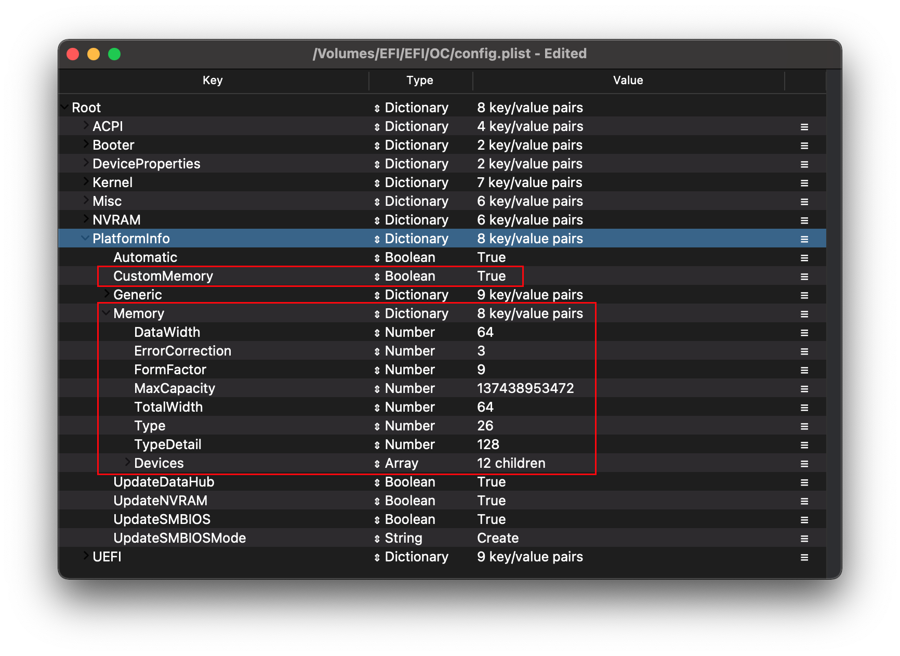

# Fixing MacPro7,1 Memory Errors

On macOS Catalina and newer, users of the MacPro7,1 SMBIOS will experience this error on each boot:

| Notification error | About This Mac Error |
| :--- | :--- |
|   |  |

The exact reason for this error is a bit unknown, however ways to resolve this error have been made possible. The most common way to remove the error was to use [MacProMemoryNotificationDisabler.kext](https://github.com/IOIIIO/MacProMemoryNotificationDisabler) however it can cause a lot of userspace stability issues as well as no longer working in Big Sur(due to missing userspace patching capabilities from Lilu).

In this guide, we'll be discussing another way to remove the error: Using OpenCore's CustomMemory

The exact way we'll be doing this is adding fake memory until we reach 12 filled slots, as any less or any empty slots will still result in memory errors. Note this won't be a super in-depth guide, instead explaining the basics of how to setup Custom Memory.

## Mapping our memory

To start, we'll want to grab the following files:

* [CustomMemory.plist](https://github.com/dortania/OpenCore-Post-Install/blob/master/extra-files/CustomMemory.plist.zip)
  * Example setup for using CustomMemory in OpenCore
* [dmidecode](https://github.com/acidanthera/dmidecode/releases)
  * Tool used for extracting SMBIOS info in macOS

Here is a premade file which has properties already set out for you, one you open it you should see the following:



From here we see may properties, lets try to break it down:

* [DataWidth](#datawidth)
* [ErrorCorrection](#errorcorrection)
* [FormFactor](#formfactor)
* [MaxCapacity](#maxcapacity)
* [TotalWidth](#totalwidth)
* [Type](#type)
* [TypeDetail](#typedetail)
* [Devices](#devices)
  * [AssetTag](#assettag)
  * [BankLocator](#banklocator)
  * [DeviceLocator](#devicelocator)
  * [Manufacturer](#manufacturer)
  * [PartNumber](#partnumber)
  * [SerialNumber](#serialnumber)
  * [Size](#size)
  * [Speed](#speed)
* [Cleaning up](#cleaning-up)

### DataWidth

Specifies the data width, in bits, of the memory. A DataWidth of 0 and a TotalWidth of 8 indicates that the device is being used solely to provide 8 error-correction bits.

To determine the DataWidth, run the following:

```sh
path/to/dmidecode -t memory | grep "Data Width:"
# Example Output
 Data Width: 64 bits
 Data Width: Unknown
 Data Width: 64 bits
 Data Width: Unknown
 Data Width: 64 bits
 Data Width: Unknown
 Data Width: 64 bits
 Data Width: Unknown
# Final Value
DataWidth = 64
```

### ErrorCorrection

Specifies ECC support:

```
1 — Other
2 — Unknown
3 — None
4 — Parity
5 — Single-bit ECC
6 — Multi-bit ECC
7 — CRC
```

To determine ErrorCorrection, run the following:

```sh
path/to/dmidecode -t memory | grep "Error Correction Type:"
# Example Output
 Error Correction Type: None
# Final Value
ErrorCorrection = 3
```

### FormFactor

Specifies Memory Form Factor

```
1  — Other
2  — Unknown
9  — DIMM
13 — SODIMM
15 — FB-DIMM
```

To determine FormFactor, run the following:

```sh
path/to/dmidecode -t memory | grep "Form Factor:"
# Example Output
 Form Factor: DIMM
 Form Factor: DIMM
 Form Factor: DIMM
 Form Factor: DIMM
 Form Factor: DIMM
 Form Factor: DIMM
 Form Factor: DIMM
 Form Factor: DIMM
# Final Value
FormFactor = 9
```

### MaxCapacity

Specifies maximum supported memory in your system

Type: Bytes

```
8GB   - 8589934592
16GB  - 17179869184
32GB  - 34359738368
64GB  - 68719476736
128GB - 137438953472
256GB - 274877906944
```

### TotalWidth

Specifies the total width, in bits, of the memory, including any check or error-correction bits. If there are no error-correction bits, this value should be equal to DataWidth.

To determine TotalWidth, run the following:

```sh
path/to/dmidecode -t memory | grep "Total Width:"
# Example Output
 Total Width: 72 bits
 Total Width: Unknown
 Total Width: 72 bits
 Total Width: Unknown
 Total Width: 72 bits
 Total Width: Unknown
 Total Width: 72 bits
 Total Width: Unknown
# Final Value
TotalWidth = 72
```

### Type

Specifies memory type

```
1  — Other
2  — Unknown
15 — SDRAM
18 — DDR
19 — DDR2
20 — DDR2 FB-DIMM
24 — DDR3
26 — DDR4
27 — LPDDR
28 — LPDDR2
29 — LPDDR3
30 — LPDDR4
```

To determine Type, run the following:

```sh
path/to/dmidecode -t memory | grep "Type:"
# Example Output
 Type: DDR4
 Type: Unknown
 Type: DDR4
 Type: Unknown
 Type: DDR4
 Type: Unknown
 Type: DDR4
 Type: Unknown
# Final Value
Type = 26
```

### TypeDetail

Specifies other memory type information

```
Bit 0 — Reserved, set to 0
Bit 1 — Other
Bit 2 — Unknown
Bit 7 — Synchronous
Bit 13 — Registered (buffered)
Bit 14 — Unbuffered (unregistered)
````

Combine all that are applicable, example:

```
Bit 13 — Registered (buffered)
Bit 14 — Unbuffered (unregistered)
-----------------------------------
27 = TypeDetail
```

To determine TypeDetail, run the following:

```sh
path/to/dmidecode -t memory | grep "Type Detail:"
# Example Output
 Type Detail: Synchronous
 Type Detail: Synchronous
 Type Detail: Synchronous
 Type Detail: Synchronous
 Type Detail: Synchronous
 Type Detail: Synchronous
 Type Detail: Synchronous
 Type Detail: Synchronous
# Final Value
TypeDetail = 7
```

### Devices

Array of Memory Devices, and where we do out magic to fix the error. In the sample CustomMemory.plist I provided, we have 12 slots listed here. From this, you'll want to open up System Profiler in macOS and look at the Memory tab:



Here we see which slots are populated by memory, and which are empty. For filled slots, simply run through the below on how to pull information. For slots that are empty however, you'll want to add some blank information into thinking macOS has populated device. Ensure that by the end, you have 12 total slots filled with devices.

Example of filled slots vs fake:



We recommend setting the Size and Speed to both 1, to ensure applications that do pull from memory are not confused that you have more than you should.

Next lets break down the properties:

* [AssetTag](#assettag)
* [BankLocator](#banklocator)
* [DeviceLocator](#devicelocator)
* [Manufacturer](#manufacturer)
* [PartNumber](#partnumber)
* [SerialNumber](#serialnumber)
* [Size](#size)
* [Speed](#speed)

#### AssetTag

To determine AssetTag, run the following:

```sh
path/to/dmidecode -t memory | grep "Asset Tag:"
#Example Output

# Final Value
```

* If dmidecode prints `Not Specified`, you can simply leave this entry blank

#### BankLocator

To determine BankLocator, run the following:

```sh
path/to/dmidecode -t memory | grep "Bank Locator:"
#Example Output

# Final Value
```

* If dmidecode prints `Not Specified`, you can simply leave this entry blank

#### DeviceLocator

To determine DeviceLocator, run the following:

```sh
path/to/dmidecode -t memory | grep "Locator:"
#Example Output
 Locator: DIMM_A1
 Locator: DIMM_A2
 Locator: DIMM_B1
 Locator: DIMM_B2
 Locator: DIMM_C1
 Locator: DIMM_C2
 Locator: DIMM_D1
 Locator: DIMM_D2
# Final Value
Entry 1:  DIMM_A1
Entry 2:  DIMM_A2
Entry 3:  DIMM_B1
Entry 4:  DIMM_B2
Entry 5:  DIMM_C1
Entry 6:  DIMM_C2
Entry 7:  DIMM_D1
Entry 8:  DIMM_D2
Entry 9:  DIMM_EMPTY
Entry 10: DIMM_EMPTY
Entry 11: DIMM_EMPTY
Entry 12: DIMM_EMPTY
```

#### Manufacturer

To determine Manufacturer, run the following:

```sh
path/to/dmidecode -t memory | grep "Manufacturer:"
#Example Output

# Final Value
```

#### PartNumber

To determine PartNumber, run the following:

```sh
path/to/dmidecode -t memory | grep "Part Number:"
#Example Output
 Part Number: KHX2666C16/8G
 Part Number: NO DIMM
 Part Number: KHX2666C16/8G
 Part Number: NO DIMM
 Part Number: KHX2666C16/8G
 Part Number: NO DIMM
 Part Number: KHX2666C15D4/8G
 Part Number: NO DIMM
# Final Value
Entry 1:  KHX2666C16/8G
Entry 2:  EmptyDIMM
Entry 3:  KHX2666C16/8G
Entry 4:  EmptyDIMM
Entry 5:  KHX2666C16/8G
Entry 6:  EmptyDIMM
Entry 7:  KHX2666C15D4/8G
Entry 8:  EmptyDIMM
Entry 9:  EmptyDIMM
Entry 10: EmptyDIMM
Entry 11: EmptyDIMM
Entry 12: EmptyDIMM
```

#### SerialNumber

To determine SerialNumber, run the following:

```sh
path/to/dmidecode -t memory | grep "Serial Number:"
#Example Output
 Serial Number: 0F095257
 Serial Number: NO DIMM
 Serial Number: 0C099A57
 Serial Number: NO DIMM
 Serial Number: 752EDED8
 Serial Number: NO DIMM
 Serial Number: A2032E84
 Serial Number: NO DIMM
# Final Value
Entry 1:  0F095257
Entry 2:  EmptyDIMM
Entry 3:  0C099A57
Entry 4:  EmptyDIMM
Entry 5:  752EDED8
Entry 6:  EmptyDIMM
Entry 7:  A2032E84
Entry 8:  EmptyDIMM
Entry 9:  EmptyDIMM
Entry 10: EmptyDIMM
Entry 11: EmptyDIMM
Entry 12: EmptyDIMM
```

#### Size

Size of single memory stick in MB

```
1GB  - 1024
2GB  - 2048
4GB  - 4096
8GB  - 8192
16GB - 16384
32GB - 32768
64GB - 65536
12GB - 131072
```

To determine Size, run the following:

```sh
path/to/dmidecode -t memory | grep "Size:"
#Example Output
 Size: 8 GB
 Size: No Module Installed
 Size: 8 GB
 Size: No Module Installed
 Size: 8 GB
 Size: No Module Installed
 Size: 8 GB
 Size: No Module Installed
# Final Value
Entry 1:  8192
Entry 2:  1
Entry 3:  8192
Entry 4:  1
Entry 5:  8192
Entry 6:  1
Entry 7:  8192
Entry 8:  1
Entry 9:  1
Entry 10: 1
Entry 11: 1
Entry 12: 1
```

#### Speed

Speed of memory in Mhz

ex: `3000Mhz`

To determine Speed, run the following:

```sh
path/to/dmidecode -t memory | grep "Speed:"
#Example Output
 Speed: 2666 MT/s
 Speed: Unknown
 Speed: 2666 MT/s
 Speed: Unknown
 Speed: 2666 MT/s
 Speed: Unknown
 Speed: 2666 MT/s
 Speed: Unknown
# Final Value
Entry 1:  2666
Entry 2:  1
Entry 3:  2666
Entry 4:  1
Entry 5:  2666
Entry 6:  1
Entry 7:  2666
Entry 8:  1
Entry 9:  1
Entry 10: 1
Entry 11: 1
Entry 12: 1
```

## Cleaning up

Now that you've built the table, we can now merge it into our config.plist.

Simply copy over your work from the CustomMemory.plist and paste it into PlatformInfo:



Once this is copied over, enable `PlatformInfo -> CustomMemory` and reboot. The error should be no more now!

Reminder that you must **fill** all 12 slots with memory, otherwise the error will not disappear:

| Fixed System Profiler | Fixed About This Mac |
| :--- | :--- |
|  |  |
