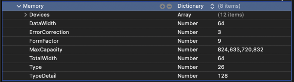
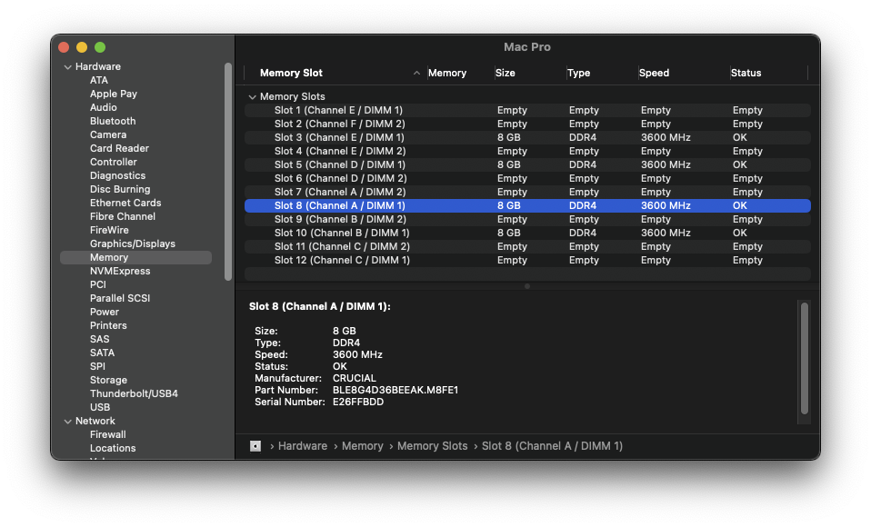

# Fixing MacPro7,1 Memory Errors

On macOS Catalina and newer, users of the MacPro7,1 SMBIOS will experience this error on each boot:

| Notification error | About This Mac Error |
| :--- | :--- |
|   |  |

The exact reason for this error is a bit unknown, however ways to resolve this error have been made possible. The most common way to remove the error is to use [RestrictEvents](https://github.com/acidanthera/RestrictEvents/releases). However, the RestrictEvents extension is a multi-function extension and you may not need nor want the extra functions that the extension will provide.

If you just want to remove the annoying pop-up, then this guide is for you...

## A bit of background

Mac OS expects the underlying hardware to be Apple hardware. Therefore, when building a hackintosh/ryzentosh we need to try and match the hardware as closely as possible. For those areas where our hardware differs, we must try to convince Mac OS that the hardware is a match.

Consider your mainboard. If you are emulating a Mac Pro 7,1 then the Apple mainboard has 12 physical RAM slots. Our mainboards will probably have fewer physical memory slots. We will use OpenCore's custom memory mapping feature to report 12 physical slots to Mac OS. We can then assign our actual memory configuration into these 12 slots.

Take a look at [Install and replace memory in your Mac Pro (2019)](https://support.apple.com/en-gb/HT210103?cid=macOS_UI_Memory_article_HT210103). The diagrams in the section "Check supported configurations" show you how a Mac Pro 7,1 expects the physical RAM to be installed.

**Please note that a Mac Pro 7,1 has a minimum requirement of 4 DIMMs.** Therefore we recommend that your system should also have a minimum of 4 physical DIMMs. If your system only has two DIMMs (maybe your mainboard only has two slots) then you will want to use the custom mapping feature to present 4 DIMMs even though you only have two. We'll explain how later...

## Gathering the values from your DIMMs using dmidecode

To start, we'll want to grab the following files:

* [CustomMemory.plist](../blob/master/extra-files/CustomMemory.plist.zip)
  * Example setup for using CustomMemory in OpenCore
* [dmidecode](https://github.com/acidanthera/dmidecode/releases)
  * Tool used for extracting SMBIOS info in macOS

Below is an image of the premade file (CustomMemory.plist above) which has properties already set out for you, once you open it you should see the following:


From here we see many properties, lets try to break it down:

* [DataWidth](#datawidth)
* [ErrorCorrection](#errorcorrection)
* [FormFactor](#formfactor)
* [MaxCapacity](#maxcapacity)
* [TotalWidth](#totalwidth)
* [Type](#type)
* [TypeDetail](#typedetail)
* [Devices](#devices)
  * [AssetTag](#assettag)
  * [BankLocator](#banklocator)
  * [DeviceLocator](#devicelocator)
  * [Manufacturer](#manufacturer)
  * [PartNumber](#partnumber)
  * [SerialNumber](#serialnumber)
  * [Size](#size)
  * [Speed](#speed)
* [Cleaning up](#cleaning-up)

### DataWidth

Specifies the data width, in bits, of the memory. A DataWidth of 0 and a TotalWidth of 8 indicates that the device is being used solely to provide 8 error-correction bits.

To determine the DataWidth, run the following:

```sh
path/to/dmidecode -t memory | grep "Data Width:"
# Example Output
 Data Width: 64 bits
 Data Width: Unknown
 Data Width: 64 bits
 Data Width: Unknown
 Data Width: 64 bits
 Data Width: Unknown
 Data Width: 64 bits
 Data Width: Unknown
# Final Value
DataWidth = 64
```

### ErrorCorrection

Specifies ECC support:

```
1 — Other
2 — Unknown
3 — None
4 — Parity
5 — Single-bit ECC
6 — Multi-bit ECC
7 — CRC
```

To determine ErrorCorrection, run the following:

```sh
path/to/dmidecode -t memory | grep "Error Correction Type:"
# Example Output
 Error Correction Type: None
# Final Value
ErrorCorrection = 3
```

### FormFactor

Specifies Memory Form Factor

```
1  — Other
2  — Unknown
9  — DIMM
13 — SODIMM
15 — FB-DIMM
```

To determine FormFactor, run the following:

```sh
path/to/dmidecode -t memory | grep "Form Factor:"
# Example Output
 Form Factor: DIMM
 Form Factor: DIMM
 Form Factor: DIMM
 Form Factor: DIMM
 Form Factor: DIMM
 Form Factor: DIMM
 Form Factor: DIMM
 Form Factor: DIMM
# Final Value
FormFactor = 9
```

### MaxCapacity

Specifies maximum supported memory in your system

Type: Bytes

```
8GB   - 8589934592
16GB  - 17179869184
32GB  - 34359738368
64GB  - 68719476736
128GB - 137438953472
256GB - 274877906944
```

### TotalWidth

Specifies the total width, in bits, of the memory, including any check or error-correction bits. If there are no error-correction bits, this value should be equal to DataWidth.

To determine TotalWidth, run the following:

```sh
path/to/dmidecode -t memory | grep "Total Width:"
# Example Output
 Total Width: 72 bits
 Total Width: Unknown
 Total Width: 72 bits
 Total Width: Unknown
 Total Width: 72 bits
 Total Width: Unknown
 Total Width: 72 bits
 Total Width: Unknown
# Final Value
TotalWidth = 72
```

### Type

Specifies memory type

```
1  — Other
2  — Unknown
15 — SDRAM
18 — DDR
19 — DDR2
20 — DDR2 FB-DIMM
24 — DDR3
26 — DDR4
27 — LPDDR
28 — LPDDR2
29 — LPDDR3
30 — LPDDR4
```

To determine Type, run the following:

```sh
path/to/dmidecode -t memory | grep "Type:"
# Example Output
 Type: DDR4
 Type: Unknown
 Type: DDR4
 Type: Unknown
 Type: DDR4
 Type: Unknown
 Type: DDR4
 Type: Unknown
# Final Value
Type = 26
```

### TypeDetail

Specifies other memory type information

```
Bit 0 — Reserved, set to 0
Bit 1 — Other
Bit 2 — Unknown
Bit 7 — Synchronous
Bit 13 — Registered (buffered)
Bit 14 — Unbuffered (unregistered)
````

Combine all that are applicable, example:

```
Bit 13 — Registered (buffered)
Bit 14 — Unbuffered (unregistered)
-----------------------------------
27 = TypeDetail
```

To determine TypeDetail, run the following:

```sh
path/to/dmidecode -t memory | grep "Type Detail:"
# Example Output
 Type Detail: Synchronous
 Type Detail: Synchronous
 Type Detail: Synchronous
 Type Detail: Synchronous
 Type Detail: Synchronous
 Type Detail: Synchronous
 Type Detail: Synchronous
 Type Detail: Synchronous
# Final Value
TypeDetail = 7
```

### Devices

The array of Memory Devices, and where we do our magic to fix the error. In the sample CustomMemory.plist provided, we have 12 slots listed. All twelve slots are set up to report an EMPTY Slot.


Next lets break down the properties:

* [AssetTag](#assettag)
* [BankLocator](#banklocator)
* [DeviceLocator](#devicelocator)
* [Manufacturer](#manufacturer)
* [PartNumber](#partnumber)
* [SerialNumber](#serialnumber)
* [Size](#size)
* [Speed](#speed)

#### AssetTag

To determine AssetTag, run the following:

```sh
path/to/dmidecode -t memory | grep "Asset Tag:"
#Example Output
Asset Tag: <BAD INDEX>
or
Asset Tag: Not Specified
or
Asset Tag: Some other text
```

* If dmidecode prints `<BAD INDEX>` or `Not Specified`, you can simply leave this entry blank

#### BankLocator

To determine BankLocator, run the following:

```sh
path/to/dmidecode -t memory | grep "Bank Locator:"
#Example Output
 Bank Locator: Not Specified
```

* If dmidecode prints `Not Specified`, you can simply leave this entry blank

#### DeviceLocator

* For best results use the CustomMemory.plist file values. Do not change them.

#### Manufacturer

To determine Manufacturer, run the following:

```sh
path/to/dmidecode -t memory | grep "Manufacturer:"
#Example Output
 Manufacturer: CRUCIAL
```

#### PartNumber

To determine PartNumber, run the following:

```sh
path/to/dmidecode -t memory | grep "Part Number:"
#Example Output
 Part Number: KHX2666C16/8G
 Part Number: NO DIMM
 Part Number: KHX2666C16/8G
 Part Number: NO DIMM
 Part Number: KHX2666C16/8G
 Part Number: NO DIMM
 Part Number: KHX2666C15D4/8G
 Part Number: NO DIMM
```

#### SerialNumber

To determine SerialNumber, run the following:

```sh
path/to/dmidecode -t memory | grep "Serial Number:"
#Example Output
 Serial Number: 0F095257
 Serial Number: NO DIMM
 Serial Number: 0C099A57
 Serial Number: NO DIMM
 Serial Number: 752EDED8
 Serial Number: NO DIMM
 Serial Number: A2032E84
 Serial Number: NO DIMM
```

#### Size

Size of single memory stick in MB. Set this to 0 if the DIMM slot should be EMPTY

```
1GB  - 1024
2GB  - 2048
4GB  - 4096
8GB  - 8192
16GB - 16384
32GB - 32768
64GB - 65536
12GB - 131072
```

To determine Size, run the following:

```sh
path/to/dmidecode -t memory | grep "Size:"
#Example Output
 Size: 8 GB
 Size: No Module Installed
 Size: 8 GB
 Size: No Module Installed
 Size: 8 GB
 Size: No Module Installed
 Size: 8 GB
 Size: No Module Installed
```

#### Speed

Speed of memory in Mhz

ex: `3000Mhz`

To determine Speed, run the following:

```sh
path/to/dmidecode -t memory | grep "Speed:"
#Example Output
 Speed: 2666 MT/s
 Speed: Unknown
 Speed: 2666 MT/s
 Speed: Unknown
 Speed: 2666 MT/s
 Speed: Unknown
 Speed: 2666 MT/s
 Speed: Unknown
```

## Mapping our memory

Now might be a good time to refresh your memory to help you understand how OpenCore is mapping the Custom Memory items in the plist file to the layout that a real Mac Pro 7,1 presents. See [Install and replace memory in your Mac Pro (2019)](https://support.apple.com/en-gb/HT210103?cid=macOS_UI_Memory_article_HT210103). The diagrams in the section "Check supported configurations" show you how a Mac Pro 7,1 expects the physical RAM to be installed.

* The naming convention for the DeviceLocator field is taken from a real Mac Pro 7,1.
* The order of the array items is important, and should be kept as it is. For example:
  * Item 0
    * Represents Slot 8 on the real Mac Pro 7,1 mainboard.
    * In turn Apple labels this slot as Channel A / DIMM 1
  * Item 1
    * Represents Slot 7 on the real Mac Pro 7,1 mainboard.
    * In turn Apple labels this slot as Channel A / DIMM 2
  * Item 2
    * Represents Slot 10 on the real Mac Pro 7,1 mainboard.
    * In turn Apple labels this slot as Channel B / DIMM 1
  * Item 3
    * Represents Slot 9 on the real Mac Pro 7,1 mainboard.
    * In turn Apple labels this slot as Channel B / DIMM 2
  * Item 4
    * Represents Slot 12 on the real Mac Pro 7,1 mainboard.
    * In turn Apple labels this slot as Channel C / DIMM 1
  * Item 5
    * Represents Slot 11 on the real Mac Pro 7,1 mainboard.
    * In turn Apple labels this slot as Channel C / DIMM 2
* If a memory slot is not populated on a real Mac Pro 7,1 the Manufacturer field is set to the text value `NO DIMM`
  * This is the critcal field to fix the error message.

## Presenting four DIMMs to Mac OS correctly

If you have four DIMMs installed on your mainboard, great! 

Your values from using dmidecode (described above) might be similar to this:

```Data Width: 64 bits
Error Correction Type: None
Form Factor: DIMM
Data Width: 64 bits
Total Width: 64 bits
Type: DDR4
Type Detail: Synchronous

Asset Tag: Not Specified
Bank Locator: Not Specified
Locator: DIMM 1
Manufacturer: CRUCIAL
Part Number: BLE8G4D36BEEAK.M8FE1
Serial Number: 8899AABB
Size: 8 GB
Speed: 3600 MT/s
```

You will edit your OpenCore EFI config.plist file to enter these values correctly.
Using your favorite plist editor, open the `PlatformInfo` section.
* Set the value of the `CustomMemory` field to `true` (or the value 1 depending on your editor).
  * You can defer this step until later. Don't forget it though, it is the master on/off value.


Under the `PlatformInfo` section there will be a `Memory` section. Open the `Memory` section.



Set the values here using the values you discovered from your physical (above from dmidecode).
E.G. Using my example data seen above...
`DataWidth` = 64
`ErrorCorrection` = 3
`FormFactor` = 9
`MaxCapacity` = 274877906944 [^1]
`TotalWidth` = 64
`Type` = 26
`TypeDetail` = 128

[^1]: The `MaxCapacity` value is dependant upon the type of processor fitted to an Apple Mac Pro 7,1. See [Mac Pro (2019) memory specifications](https://support.apple.com/en-gb/HT210405). The value should be one of:
| Max RAM | Expressed as bytes |
| 768GB | `824633720832` |
| 1.5TB | `1649267441664` |


| Fixed System Profiler | Fixed About This Mac |
| :--- | :--- |
|  |  |
