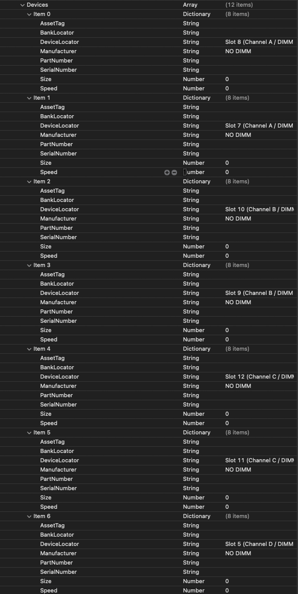

# Fixing MacPro7,1 Memory Errors

On macOS Catalina and newer, users of the MacPro7,1 SMBIOS will experience this error on each boot:

| Notification error | About This Mac Error |
| :--- | :--- |
|   |  |

The most common way to remove the error is to use [RestrictEvents](https://github.com/acidanthera/RestrictEvents/releases) Kernel extension (KEXT) from the OpenCore team. However, the RestrictEvents extension is a multi-function extension and you may not need nor want the extra functions that the extension will provide.

If you just want to remove the annoying pop-up, then this guide is for you...

## A bit of background

Mac OS expects the underlying hardware to be Apple hardware. Therefore, when building a hackintosh/ryzentosh we need to try and match the hardware as closely as possible. For those areas where our hardware differs, we must try to convince Mac OS that the hardware is a match.

Consider your mainboard. If you are emulating a Mac Pro 7,1 then the Apple mainboard has 12 physical RAM slots. Our mainboards will probably have fewer physical memory slots. We will use OpenCore's custom memory mapping feature to report 12 "virtual" slots to Mac OS. We can then assign our physical memory configuration into these 12 virtual slots.

Take a look at [Install and replace memory in your Mac Pro (2019)](https://support.apple.com/en-gb/HT210103?cid=macOS_UI_Memory_article_HT210103). The diagrams in the section "Check supported configurations" show you how a Mac Pro 7,1 expects the physical RAM to be installed.

**Please note that a Mac Pro 7,1 has a minimum requirement of 4 DIMMs.**

Therefore we recommend that your system should also have a minimum of 4 physical DIMMs. If your system only has two DIMMs (maybe your mainboard only has two slots) then you will want to use the custom mapping feature to present 4 DIMMs even though you only have two. We'll explain how later...

---

## Mapping our memory

A Mac Pro 7,1 has 12 slots, and can have 4, 6, 8, 10, or 12 DIMMs installed. We will demonstrate the 4-DIMM solution here, but simply follow the same procedure for the other multiples.

The PlatformInfo Memory section of the OpenCore config.plist allows us to present 12 slots to Mac OS. The trick is to populate these "virtual slots" with our real DIMM values. 

Using the example unpopulated plist file, opened in Xcode, the OpenCore Devices section looks like this:

* The order of the array items is important, and should be kept as it is. For example:
  * Item 0
    * Represents Slot 8 on the real Mac Pro 7,1 mainboard, labeled as Channel A / DIMM 1
  * Item 1
    * Represents Slot 7 on the real Mac Pro 7,1 mainboard, labeled as Channel A / DIMM 2
  * Item 2
    * Represents Slot 10 on the real Mac Pro 7,1 mainboard, labeled as Channel B / DIMM 1
  * Item 3
    * Represents Slot 9 on the real Mac Pro 7,1 mainboard, labeled as Channel B / DIMM 2
  * Item 4
    * Represents Slot 12 on the real Mac Pro 7,1 mainboard, labeled as Channel C / DIMM 1
  * Item 5
    * Represents Slot 11 on the real Mac Pro 7,1 mainboard, labeled as Channel C / DIMM 2
  * Item 6
    * Represents Slot 5 on the real Mac Pro 7,1 mainboard, labeled as Channel D / DIMM 1
  * Item 7
    * Represents Slot 6 on the real Mac Pro 7,1 mainboard, labeled as Channel D / DIMM 2
  * Item 8
    * Represents Slot 3 on the real Mac Pro 7,1 mainboard, labeled as Channel E / DIMM 1
  * Item 9
    * Represents Slot 4 on the real Mac Pro 7,1 mainboard, labeled as Channel E / DIMM 2
  * Item 10
    * Represents Slot 1 on the real Mac Pro 7,1 mainboard, labeled as Channel F / DIMM 1
  * Item 11
    * Represents Slot 2 on the real Mac Pro 7,1 mainboard, labeled as Channel F / DIMM 2

> If a memory slot is not populated on a real Mac Pro 7,1 the Manufacturer field is set to the text value `NO DIMM`.
> This is the critical field to fix the error message.

---

## Download example plist files

- [CustomMemoryUnpopulated.plist.zip](../extra-files/CustomMemoryUnpopulated.plist.zip)
- [CustomMemoryPopulatedWithFourDIMMs.zip](../extra-files/CustomMemoryPopulatedWithFourDIMMs.plist.zip)
- [CustomMemoryPopulatedWithSixDIMMs.zip](../extra-files/CustomMemoryPopulatedWithSixDIMMs.plist.zip)
- [CustomMemoryPopulatedWithEightDIMMs.zip](../extra-files/CustomMemoryPopulatedWithEightDIMMs.plist.zip)
- [CustomMemoryPopulatedWithTenDIMMs.zip](../extra-files/CustomMemoryPopulatedWithTenDIMMs.plist.zip)
- [CustomMemoryPopulatedWithTwelveDIMMs.zip](../extra-files/CustomMemoryPopulatedWithTwelveDIMMs.plist.zip)

You can perform your edits to a copy of these example plist files, and then when you are sure that you have everything in place, copy the contents from the example plist file to your OpenCore config.plist file...

OR

You can edit your OpenCore config.plist file directly using the example plist files for reference...

---

On the [next page](memory-gathering-data.md) we will discover how to use dmidecode to find the values to use in the config.plist file...
