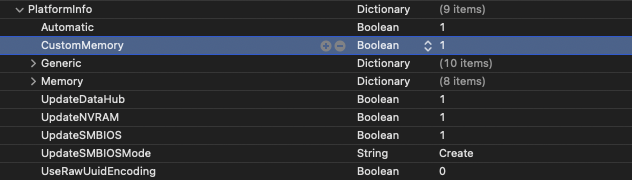

# Fixing MacPro7,1 Memory Errors

On macOS Catalina and newer, users of the MacPro7,1 SMBIOS will experience this error on each boot:

| Notification error | About This Mac Error |
| :--- | :--- |
|   |  |

The exact reason for this error is a bit unknown, however ways to resolve this error have been made possible. The most common way to remove the error is to use [RestrictEvents](https://github.com/acidanthera/RestrictEvents/releases). However, the RestrictEvents extension is a multi-function extension and you may not need nor want the extra functions that the extension will provide.

If you just want to remove the annoying pop-up, then this guide is for you...

## A bit of background

Mac OS expects the underlying hardware to be Apple hardware. Therefore, when building a hackintosh/ryzentosh we need to try and match the hardware as closely as possible. For those areas where our hardware differs, we must try to convince Mac OS that the hardware is a match.

Consider your mainboard. If you are emulating a Mac Pro 7,1 then the Apple mainboard has 12 physical RAM slots. Our mainboards will probably have fewer physical memory slots. We will use OpenCore's custom memory mapping feature to report 12 physical slots to Mac OS. We can then assign our actual memory configuration into these 12 slots.

Take a look at [Install and replace memory in your Mac Pro (2019)](https://support.apple.com/en-gb/HT210103?cid=macOS_UI_Memory_article_HT210103). The diagrams in the section "Check supported configurations" show you how a Mac Pro 7,1 expects the physical RAM to be installed.

**Please note that a Mac Pro 7,1 has a minimum requirement of 4 DIMMs.** Therefore we recommend that your system should also have a minimum of 4 physical DIMMs. If your system only has two DIMMs (maybe your mainboard only has two slots) then you will want to use the custom mapping feature to present 4 DIMMs even though you only have two. We'll explain how later...

---

## Download example plist files

[CustomMemoryUnpopulated.plist.zip](../extra-files/CustomMemoryUnpopulated.plist.zip)

[CustomMemoryPopulatedWithFourDIMMs.zip](../extra-files/CustomMemoryPopulatedWithFourDIMMs.plist.zip)

---

## Mapping our memory

A Mac Pro 7,1 has 12 slots, and can have 4, 6, 8, 10, or 12 DIMMs installed. We will demonstrate the 4-DIMM solution here, but simply follow the same procedure for the other multiples.

The PlatformInfo Memory section of the OpenCore config.plist allows us to preset 12 slots to Mac OS. The trick is to populate these "virtual slots" with our real DIMM values. 

Using the example unpopulated plist file, opened in XCode, the OpenCore Devices section looks like this:


* The order of the array items is important, and should be kept as it is. For example:
  * Item 0
    * Represents Slot 8 on the real Mac Pro 7,1 mainboard, labelled as Channel A / DIMM 1
  * Item 1
    * Represents Slot 7 on the real Mac Pro 7,1 mainboard, labelled as Channel A / DIMM 2
  * Item 2
    * Represents Slot 10 on the real Mac Pro 7,1 mainboard, labelled as Channel B / DIMM 1
  * Item 3
    * Represents Slot 9 on the real Mac Pro 7,1 mainboard, labelled as Channel B / DIMM 2
  * Item 4
    * Represents Slot 12 on the real Mac Pro 7,1 mainboard, labelled as Channel C / DIMM 1
  * Item 5
    * Represents Slot 11 on the real Mac Pro 7,1 mainboard, labelled as Channel C / DIMM 2
  * Etc...

> If a memory slot is not populated on a real Mac Pro 7,1 the Manufacturer field is set to the text value `NO DIMM`.
> This is the critcal field to fix the error message.


## Presenting four DIMMs to Mac OS correctly

If you have four DIMMs installed on your mainboard, great! 

Your values from using dmidecode (described above) might be similar to this:

```Data Width: 64 bits
Error Correction Type: None
Form Factor: DIMM
Data Width: 64 bits
Total Width: 64 bits
Type: DDR4
Type Detail: Synchronous

Asset Tag: Not Specified
Bank Locator: Not Specified
Locator: DIMM 1
Manufacturer: CRUCIAL
Part Number: BLE8G4D36BEEAK.M8FE1
Serial Number: 8899AABB
Size: 8 GB
Speed: 3600 MT/s
```

You will edit your OpenCore EFI config.plist file to enter these values correctly.
Using your favorite plist editor, open the `PlatformInfo` section.
* Set the value of the `CustomMemory` field to `true` (or the value 1 depending on your editor).
  * You can defer this step until later. Don't forget it though, it is the master on/off value.



Under the `PlatformInfo` section there will be a `Memory` section. Open the `Memory` section.

Set the values here using the values you discovered from your physical RAM (above from dmidecode).
E.G. Using my example data seen above...

`DataWidth` = 64

`ErrorCorrection` = 3

`FormFactor` = 9

`MaxCapacity` = 824633720832

`TotalWidth` = 64

`Type` = 26

`TypeDetail` = 128

> Remember, the `MaxCapacity` value is dependant upon the type of processor fitted to an Apple Mac Pro 7,1. See [Mac Pro (2019) memory specifications](https://support.apple.com/en-gb/HT210405). The value should be one of:

| Max RAM | Expressed as bytes |
|---------|--------------------|
| 768GB | `824633720832` |
| 1.5TB | `1649267441664` |


Under the `Memory` section there will be a `Devices` section. Open the `Devices` section.

We are going to "populate" the 12-slots with four DIMMS. Referring back to [Install and replace memory in your Mac Pro (2019)](https://support.apple.com/en-gb/HT210103?cid=macOS_UI_Memory_article_HT210103) we can see that our four DIMMS need to go into slots 3, 5, 8, and 10.

In the config.plist file Devices section...

| Item number | Is Slot | Referenced as |
|-------------|---------|---------------|
| 0 | is slot 8 | referenced as Channel A / DIMM 1 |
| 2 | is slot 10 | referenced as Channel B / DIMM 1 |
| 6 | is slot 5 | referenced as Channel D / DIMM 1 |
| 8 | is slot 3 | referenced as Channel C / DIMM 1 |


All other items should be "EMPTY" slots.

The important key is the `Manufacturer` key should be set to `NO DIMM` for an empty slot. 

Keys `Size` and `Speed` should both be set to `0` for an empty slot.


| Fixed System Profiler | Fixed About This Mac |
| :--- | :--- |
|  |  |


---

On the [next page](memory-gathering-data.md) we will discover how to use dmidecode to find the values to use in the config.plist file...
