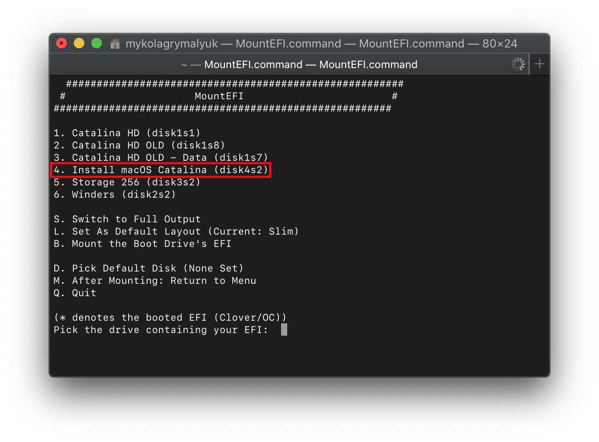
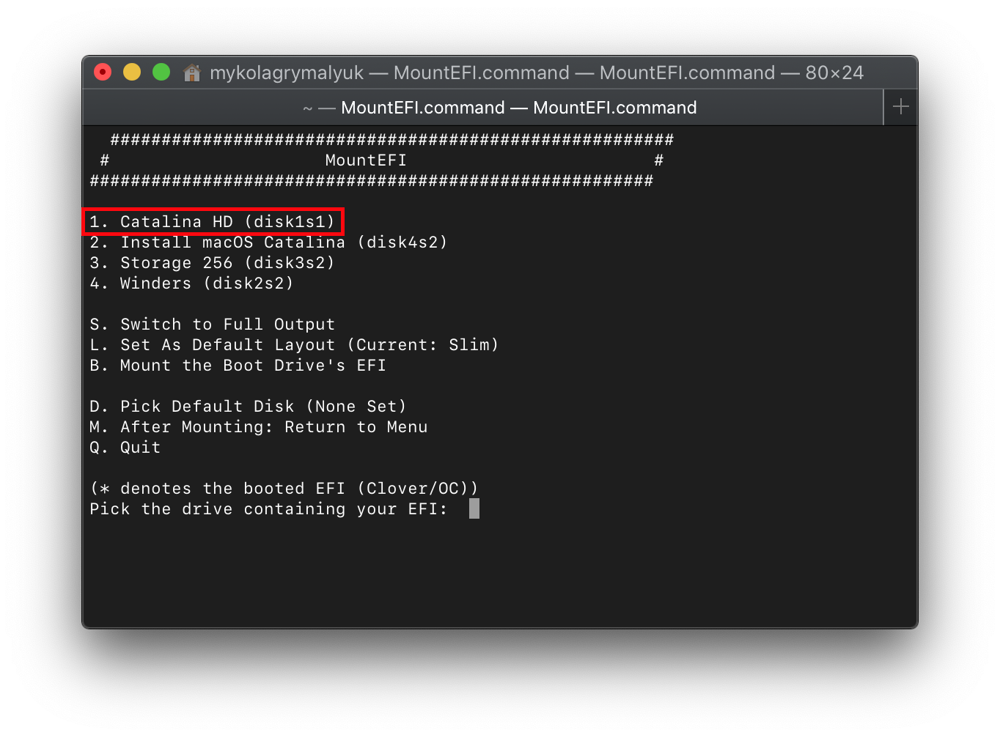
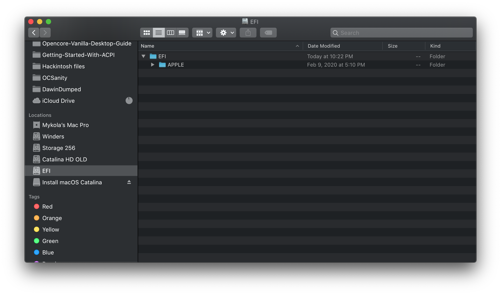

# Moving OpenCore from USB to macOS Drive

## Grabbing OpenCore off the USB

So to start, we'll first want to grab OpenCore off of our installer. To do this, we'll be using a neat tool from CorpNewt called [MountEFI](https://github.com/corpnewt/MountEFI)

For this example, we'll assume your USB is called `Install macOS Catalina`:

Once the EFI's mounted, we'll want to grab our EFI folder on there and keep in a safe place. We'll then want to **eject the USB drive's EFI** as having multiple EFI's mounted can confuse macOS sometimes, best practice is to keep only 1 EFI mounted at a time(you can eject just the EFI, the drive itself doesn't need to be removed)

**Note**: Installers made with gibMacOS's MakeInstall.bat on Windows will default to a Master Boot Record(MBR) partition map, this means there is no dedicated EFI partition instead being the `BOOT` partition that mounts by default in macOS.

Now with this done, lets mount our macOS drive. With macOS Catalina, macOS is actually partitioned into 2 volumes: System Partition and User Partition. This means that MountEFI may report multiple drives in it's picker but each partition will still share the same EFI(The UEFI spec only allows for 1 EFI per drive). You can tell if it's the same drive with disk**X**sY (Y is just to say what partition it is)

When you mount your main drive's EFI, you may be greeted with a folder called `APPLE`, this is used for updating the firmware on real Macs but has no effect on our hardware. You can wipe everything on the EFI partition and replace it with the one found on your USB

## Special notes for legacy users

When transferring over your EFI, there are still boot sectors that need to be written to so your non-UEFI BIOS would be able to find it. So don't forget to rerun the [`BootInstallARCH.tool`](https://dortania.github.io/OpenCore-Install-Guide/installer-guide/mac-install.html#legacy-setup) on your macOS drive.

## Suggestions for improvement
This seems to be the only way I have to point out deficiencies on the documentation.  Please note, I am proficient on a large variety of platforms but not Apple. The directions on this page might be 
intuitively obvious for those familiar with the Apple OS platforms but not for other folks.  What I'm listing here are the pain points I encountered due to ambiguity and lack of instructions. The following reference line numbers refer to the line numbers in this file.

**Line 11** Once the EFI's mounted... There is a lack of clarity on exactly what needs to be copied and from what directory.  Just indicating "EFI Folder" leaves the user wondering exactly what needs to be saved.

**Line 11** Eject the USB drive's..., for somebody who does not normally operate in an Apple environment, a picture would be helpful to indicate where the eject should be initiated.

**Line 21** You can wipe... is this a seperate and unique step or should this only be executed if the "APPLE" folder exists?
**Line 21** replace it with the one found on your USB.  Wait a moment, I ejected my USB so where do I obtain this folder? Is this the folder I previous saved in a safe spot?
