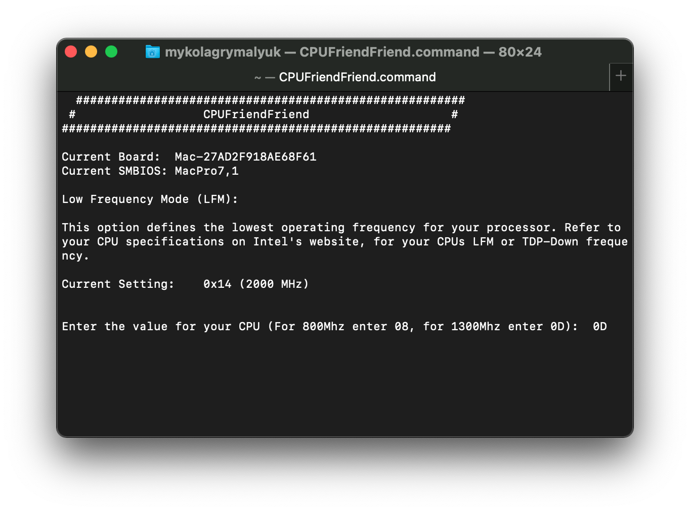

# Optimizing Power Management

## Enabling X86PlatformPlugin

So before we can fine tune power management to our liking, we need to first make sure Apple's XCPM core is loaded. Note that this is supported **only on Haswell and newer**, consumer Sandy, Ivy Bridge and AMD CPUs should refer to the bottom of the guides:

* [Sandy and Ivy Bridge Power Management](../universal/pm.md#sandy-and-ivy-bridge-power-management)
* [AMD CPU Power Management](../universal/pm.md#amd-cpu-power-management)

Ivy Bridge and Ivy Bridge-E note: Apple dropped support for XCPM back in macOS Sierra, so XCPM is only supported between 10.8.5 and 10.11.6. Newer OSes will require the [ssdtPRgen method](../universal/pm.md#sandy-and-ivy-bridge-power-management)

* To enabled XCPM in older OSes(ie. 10.11 and older), simply add `-xcpm` to your boot-args

To start, grab [IORegistryExplorer](https://github.com/khronokernel/IORegistryClone/blob/master/ioreg-302.zip) and look for `AppleACPICPU`(note if you use search, it won't show the children so clear your search once you've found the entry):

XCPM Present           |  Missing XCPM
:-------------------------:|:-------------------------:
  |  

As you can see from the left image, we have the X86PlatformPlugin attached meaning Apple's CPU Power Management Drivers are doing their thing(Note the CPU's name does not matter, CPU names come in many variations such as CP00, CPU0, PR00, etc. What matters is that AppleACPICPU attaches to it). If you get something like to the right image, then there's likely an issue. Make sure to check the following:

* SSDT-PLUG.**aml** is both present and enabled in your config.plist and EFI/OC/ACPI
  * If you're missing this, head to [Getting Started With ACPI](https://dortania.github.io/Getting-Started-With-ACPI) on how to make this
* SSDT-PLUG is set to the first thread of your CPU, you can check by selecting the first CPU listed(`CP00` for our example) and make sure you have this in the properties:

```
plugin-type | Number | 0x1
```

**X99 Note**:

XCPM does not natively support Haswell-E and Broadwell-E, this means we need to spoof the CPU ID into a model that does supports XCPM:

* **Haswell-E**:

  * `Kernel -> Emulate`:
    * Cpuid1Data: `C3060300 00000000 00000000 00000000`
    * Cpuid1Mask: `FFFFFFFF 00000000 00000000 00000000`

* **Broadwell-E**:

  * `Kernel -> Emulate`:
    * Cpuid1Data: `D4060300 00000000 00000000 00000000`
    * Cpuid1Mask: `FFFFFFFF 00000000 00000000 00000000`

## Using CPU Friend

To start, we're gonna need a couple things:

* X86PlatformPlugin loaded
  * This means Sandy, Ivy Bridge and AMD CPUs are not supported
* [CPUFriend](https://github.com/acidanthera/CPUFriend/releases)
* [CPUFriendFriend](https://github.com/corpnewt/CPUFriendFriend)

### LFM: Low Frequency Mode

Now lets run CPUFriendFriend.command:



When you first open up CPUFriendFriend, you'll be greeted with a prompt for choosing your LFM value. This can be seen as the floor of your CPU, or the lowest value it'll idle at. This value can greatly help with sleep functioning correctly as macOS needs to be able to transition from S3(sleep) to S0(wake) easily.

To determine your LPM value, you can either:

* Look for the `TDP-down Frequency` on Intel's [ARK site](https://ark.Intel.com/)
  * Note most CPUs do not have a listed value, so you'll need to determine yourself
* Or choose recommended values:

| Generation | LFM Value | Comment |
| :--- | :--- | :--- |
| Broadwell+ Laptops | 08 | Equivalent of 800Mhz |
| Broadwell+ Desktops | 0A | Equivalent of 1000Mhz |
| Haswell/Broadwell HEDT/Server(ie. X99) | 0D | Equivalent of 1300Mhz |
| Skylake+ HEDT/Server(ie. X299) | 0C | Equivalent of 1200Mhz |

* **Note**: LFM value is only available on Broadwell and newer SMBIOS
* **Note 2**: these values are not set in stone, each machine will have unique characteristics and so you'll need to experiment what works best for your hardware

For this example we'll be using the [i9 7920x](https://ark.Intel.com/content/www/us/en/ark/products/126240/Intel-core-i9-7920x-x-series-processor-16-5m-cache-up-to-4-30-ghz.html) which has a base clock of 2.9 GHz but no LFM, so we'll choose 1.3 GHz(ie. 1300Mhz) and work our way up/down until we find stability.

* Note that the LFM value is simply the CPU's multiplier, so you'll need to trim your value appropriately
  * ie. Divide by 100, then convert to hexadecimal

```sh
echo "obase=16; 13" | bc
```

* Pay close attention we used 13 for 1.3Ghz and not 1.3

### EPP: Energy Performance Preference


Next up is the Energy Performance Preference, EPP. This tells macOS how fast to turbo up the CPU to its full clock. `00` will tell macOS to let the CPU go as fast as it can as quickly as it can while `FF` will tell macOS to take things slowly and let the CPU ramp up over a much longer period of time. Depending on what you're doing and the cooling on your machine, you may want to set something in the middle. Below chart can help out a bit:

| EPP | Speed |
| :--- | :--- |
| 0x00-0x3F| Max Performance |
| 0x40-0x7F | Balance performance |
| 0x80-0xBF | Balance power |
| 0xC0-0xFF | Max Power Saving |

**Note**: Only Skylake and newer SMBIOS officially support EPP

### Performance Bias


This final entry is to help macOS out what kind of overall performance you'd like from your CPU. The general recommendation depends on your exact setup, and experimenting does help figure out what's best for you.

### Cleaning up


Once you're finished, you'll be provided with a CPUFriendDataProvider.kext and ssdt_data.aml. Which you choose is your preference but I recommend the kext variant to avoid any headaches with data injection into Windows and Linux.

* **Note**: Load order does not matter with the CPUFriendDataProvider as it's just a plist-only kext
* **Note 2**: Wake issues resulting from CPUFriend is likely due to incorrect frequency vectors, every system is unique so you'll need to play around until you get a stable config. Kernel panics will have `Sleep Wake failure in efi`.
* **Note 3**: If you do choose to use ssdt_data.aml, note that SSDT-PLUG is no longer needed. However the setup for this SSDT is broken on HEDT platforms like X99 and X299, so we highly recommend SSDT-PLUG with CPUFriendDataProvider.kext instead.

## Sandy and Ivy Bridge Power Management

With Sandy and Ivy Bridge, consumer PCs have issues connecting to Apple's XCPM. So to get around this we need to create our own Power Management Table.

What we'll need:

* Ensure CpuPm and Cpu0Ist tables are **NOT** dropped
* [ssdtPRGen](https://github.com/Piker-Alpha/ssdtPRGen.sh)

Initialing with OpenCore's setup in the Ivy Bridge section, we recommended users drop their CpuPm and Cpu0Ist to avoid any issues with AppleIntelCPUPowerManagement.kext. But dropping these tables have the adverse affect of breaking turbo boost in Windows. So to resolve this, we'll want to keep our OEM's table but we'll want to add a new table to supplement data only for macOS. So once we're done creating our CPU-PM table, we'll re-add our OEM's CPU SSDTs.

To start, grab your config.plist then head to ACPI -> Delete and ensure both of these sections have `Enabled` set to YES:

| Key | Type | Value |
| :--- | :--- | :--- |
| All | Boolean | YES |
| Comment | String | Drop CpuPm |
| Enabled | Boolean | YES |
| OemTableId | Data | 437075506d000000 |
| TableLength | Number | 0 |
| TableSignature | Data | 53534454 |

| Key | Type | Value |
| :--- | :--- | :--- |
| All | Boolean | YES |
| Comment | String | Drop Cpu0Ist |
| Enabled | Boolean | YES |
| OemTableId | Data | 4370753049737400 |
| TableLength | Number | 0 |
| TableSignature | Data | 53534454 |

Once this is done, reboot, we can now grab ssdtPRGen and run it:


Once you're done, you'll be provided with an SSDT.aml under `/Users/your-name>/Library/ssdtPRGen/ssdt.dsl`, you can easily find it with the Cmd+Shift+G shortcut and pasting `~/Library/ssdtPRGen/`


Remember to now add this to both EFI/OC/ACPI and your config.plist, I recommend renaming it to SSDT-PM to find it more easily.

Finally, we can disable our previous ACPI -> Delete entries(`Enabled` set to NO):

| Key | Type | Value |
| :--- | :--- | :--- |
| All | Boolean | YES |
| Comment | String | Drop CpuPm |
| Enabled | Boolean | NO |
| OemTableId | Data | 437075506d000000 |
| TableLength | Number | 0 |
| TableSignature | Data | 53534454 |

| Key | Type | Value |
| :--- | :--- | :--- |
| All | Boolean | YES |
| Comment | String | Drop Cpu0Ist |
| Enabled | Boolean | NO |
| OemTableId | Data | 4370753049737400 |
| TableLength | Number | 0 |
| TableSignature | Data | 53534454 |

### ssdtPRgen Troubleshooting

While ssdtPRgen tries to handle any incompatibility issues with your OEM's SSDT, you may find it still clashes on boot as your OEM has already declared certain devices or methods in sections like `_INI` or `_DSM`.

If you find during boot up you get errors such as this one from SSDT-PM:

```
ACPI Error: Method parse/execution failed [\_SB._INI] , AE_ALREADY_EXIST
```

This means there's some conflict, to resolve this, we recommend moving ssdtPRgen's info into a format like this:

```c
DefinitionBlock ("ssdt.aml", "SSDT", 1, "APPLE ", "CpuPm", 0x00021500)
{
    External (\_PR_.CPU0, DeviceObj) // External Processor definition
    External (\_PR_.CPU1, DeviceObj) // External Processor definition

    Scope (\_PR_.CPU0) // Processor's scope
    {
        Name (APLF, Zero)
        Name (APSN, 0x04)
        Name (APSS, Package (0x20)
        {
            /*  … */
        })

        Method (ACST, 0, NotSerialized)
        {
            /*  … */
        }

        /*  … */
    }
```

Pay close attention to what we've done:

* Made sure the Processor object is moved to external
* Move all your methods into the Processor's scope

For editing and re-compiling the SSDT-PM, see here: [Getting Started With ACPI](https://dortania.github.io/Getting-Started-With-ACPI/)

### BIOS Troubleshooting

For some boards, you may need to ensure the following BIOS options are set for CPU Power Management:

* C States: `True`
* P States Coordination: `SW_ALL`

## AMD CPU Power Management

While macOS might not officially support AMD CPU Power management, there are community efforts to add it. Specifically being [SMCAMDProcessor](https://github.com/trulyspinach/SMCAMDProcessor). Note that when adding this kext, it should be after VirtualSMC in your config.plist as it's a plugin.

**Warning**: This kext is known to create stability issues as well, if you're receiving random kernel panics or issues booting do keep in mind this kext may be the culprit.
