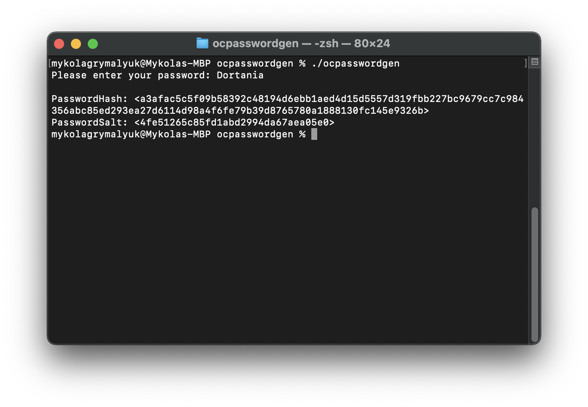
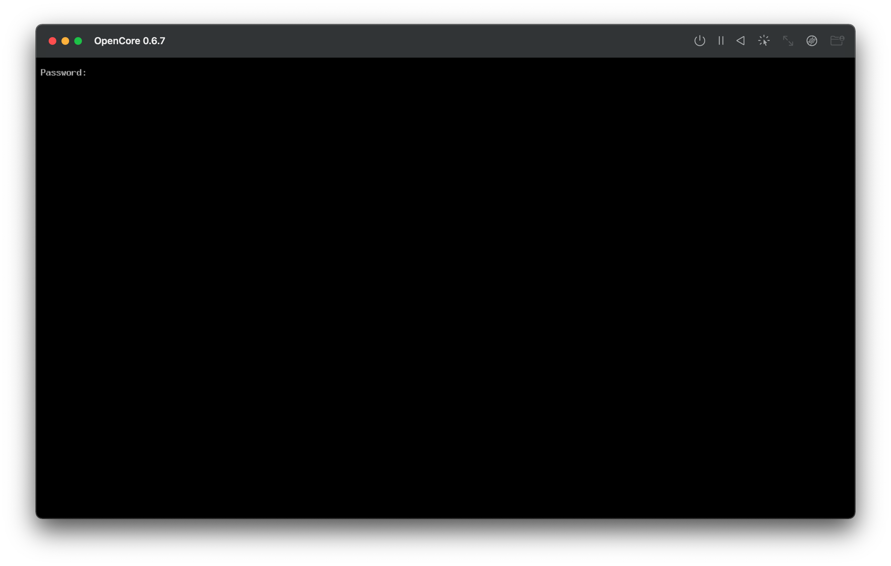
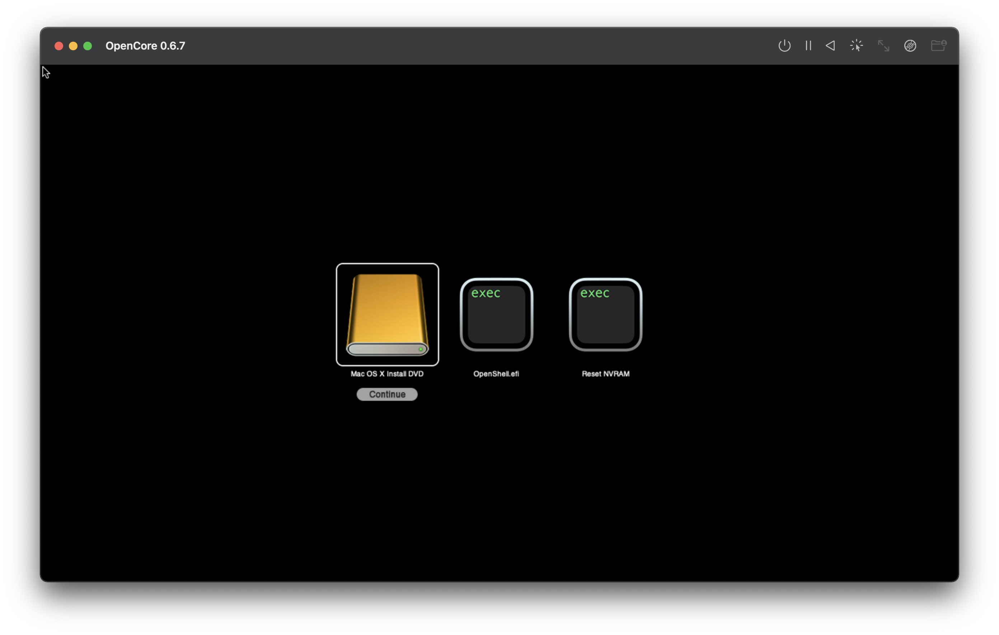

# OpenCore Menu Password

With OpenCore 0.6.1 and newer, users are able to set a SHA-512 password to ensure best security with their setups. This will enable a password prompt whenever elevated tasks are required. This includes:

* Showing boot menu
* Booting non-default OSes and tools(ie. not blessed by Startup Disk or Bootcamp Utility)
* Resetting NVRAM
* Booting non-default modes(ie. Verbose or Safe Mode via hotkeys)

With OpenCore 0.6.7, a new tool called `ocpasswordgen` was added to aid users in generating passwords.

To start, let's grab OpenCore 0.6.7 or newer and run the `ocpasswordgen` binary under `Utilities/ocpasswordgen/`. It'll prompt you to create a password:

For this example, we chose `Dortania` as the password. `ocpasswordgen` then popped out 2 important values we need for our config.plist:

* PasswordHash: Hash of the password
* PasswordSalt: Ensures 2 users with the exact same password do not do not have the same hash

Next let's open our config.plist and add these values to Misc -> Security:

* Note: Don't forget to also enable `EnablePassword`

Once these changes have been made, you can save and reboot the machine. Now when you enter OpenCore's menu, you should receive a prompt:

Enter your password and you should get your regular boot options:

* Note: Between typing the password and entering the menu, some older machines and VMs can take 30 seconds+ to finish verification. Please be patient

