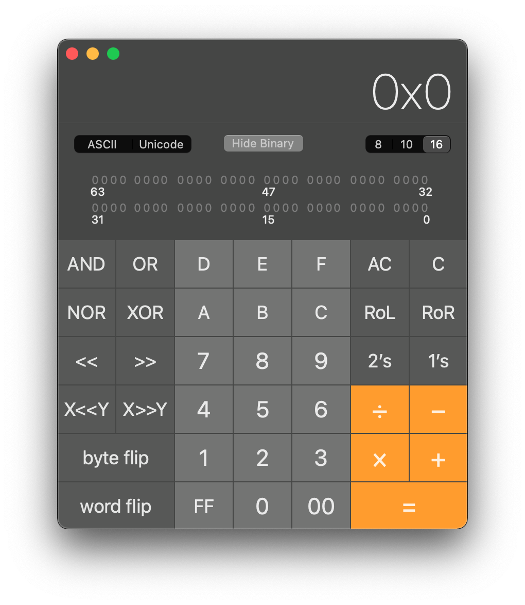

# ScanPolicy

What this quirk allows to prevent scanning and booting from untrusted sources. Setting to `0` will allow all sources present to be bootable but calculating a specific ScanPolicy value will allow you a greater range of flexibility and security.

To calculate the ScanPolicy value, you simply add up all the hexadecimal values(with a hexadecimal calculator, you can access this from the built-in macOS calculator app with `⌘+3`). Once it's all added up, you would add this hexadecimal value to ScanPolicy(you will need to convert it to a decimal value first, Xcode will automatically convert it when you paste it)

::: details Hexadecimal Calculator

| Menubar | Calculator |
| :--- | :--- |
|  |  |

:::

| Value | Bit | Name | Comment |
| :--- | :--- | :--- | :--- |
| 0x00000001 | bit 0 | OC_SCAN_FILE_SYSTEM_LOCK | Restricts scanning to only known file systems defined as a part of this policy. This bit does not affect dmg mounting. Known file systems are prefixed with `OC_SCAN_ALLOW_FS_`. |
| 0x00000002 | bit 1 | OC_SCAN_DEVICE_LOCK | Restricts scanning to only known device types defined as a part of this policy. Known device types are prefixed with `OC_SCAN_ALLOW_DEVICE_`. |
| 0x00000100 | bit 8 | OC_SCAN_ALLOW_FS_APFS | Allows scanning of APFS file system. |
| 0x00000200 | bit 9 | OC_SCAN_ALLOW_FS_HFS | Allows scanning of HFS file system. |
| 0x00000400 | bit 10 | OC_SCAN_ALLOW_FS_ESP | Allows scanning of EFI System Partition file system. |
| 0x00010000 | bit 16 | OC_SCAN_ALLOW_DEVICE_SATA | Allow scanning SATA devices. |
| 0x00020000 | bit 17 | OC_SCAN_ALLOW_DEVICE_SASEX | Allow scanning SAS and Mac NVMe devices. |
| 0x00040000 | bit 18 | OC_SCAN_ALLOW_DEVICE_SCSI | Allow scanning SCSI devices. |
| 0x00080000 | bit 19 | OC_SCAN_ALLOW_DEVICE_NVME | Allow scanning NVMe devices. |
| 0x00100000 | bit 20 | OC_SCAN_ALLOW_DEVICE_ATAPI | Allow scanning CD/DVD devices. |
| 0x00200000 | bit 21 | OC_SCAN_ALLOW_DEVICE_USB | Allow scanning USB devices. |
| 0x00400000 | bit 22 | OC_SCAN_ALLOW_DEVICE_FIREWIRE | Allow scanning FireWire devices. |
| 0x00800000 | bit 23 | C_SCAN_ALLOW_DEVICE_SDCARD | Allow scanning card reader devices. |
| 0x01000000 | bit 24 | OC_SCAN_ALLOW_DEVICE_PCI | Allow scanning devices directly connected to PCI bus (e.g. VIRTIO). |

By default, ScanPolicy is given a value of `0x10F0103`(17,760,515) which is the combination of the following:

* 0x00000001 - `OC_SCAN_FILE_SYSTEM_LOCK` 
* 0x00000002 - `OC_SCAN_DEVICE_LOCK` 
* 0x00000100 - `OC_SCAN_ALLOW_FS_APFS` 
* 0x00010000 - `OC_SCAN_ALLOW_DEVICE_SATA` 
* 0x00020000 - `OC_SCAN_ALLOW_DEVICE_SASEX`
* 0x00040000 - `OC_SCAN_ALLOW_DEVICE_SCSI` 
* 0x00080000 - `OC_SCAN_ALLOW_DEVICE_NVME` 
* 0x01000000 - `OC_SCAN_ALLOW_DEVICE_PCI` 

And lets just say for this example that you want to add `OC_SCAN_ALLOW_DEVICE_USB`:

`0x00200000` + `0x10F0103` = `0x12F0103`

And converting this to decimal gives us `19,857,667`, which we can now enter into `Misc -> Secuirty -> ScanPolicy`
