# UEFI Secure Boot

* Based off of CodeRush's [Taming UEFI SecureBoot](https://habr.com/en/post/273497/)


To start setting up UEFI Secure Boot on your machine, we'll first need to ensure a few things:


* Apple Secure Boot Page has been followed correctly
  * This includes DmgLoading and SecureBootModel, ApECID is optional however we strongly encourage you to set this up as well
  * Reminder DmgLoading must be set to either `Signed` or `Disabled`
* You've setup Vaulting
  * Note Vaulting and FileVault are different, FieVault is not require for UEFI Secure Boot however is still strongly encouraged
* Your firmware allows you to add custom Secure Boot keys
  * This guide will focus on AMI, Insyde and Phoneix firmwares mainly
* A Linux install
  * Either another machine running Linux, Live USB or already installed on the target machine, we need this to create our UEFI Keys
* Extra UEFI Tools(See your Package manager on how to obtain)
  * openssl
  * efitools
  * sbsigntool
  

**And a very important reminder**: Setting up UEFI Secure Boot should only be done if you're comfortable working with security keys and terminal. This is not a simple 1 click setup guide. You are responsible for any issues around security keys you face.

## Terminology

::: details Terminology around Secure Boot

| Name | Abbreviation | Explanation |
| :--- | :--- | :--- |
| Platform Key | PK | Key between the platform owner and the firmware |
| Key Exchange Key | KEK | Key between the firmware and the OS |
| Initial Supplier Key | ISK | Root Certificate for the OEM |
| Whitelist Database | db | List of public keys of authorized firmware or software. |
| Blacklist Database | dbx | List of public keys known to correspond to malicious or unauthorized firmware or software. |
| AMI Aptio | APTIO | Firmware developed by [American Megatrends Inc](https://ami.com/en/), used in the majority of consumer desktops and laptops |
| Insyde H2O | iH2O | Firmware developed by [Insyde](https://www.insyde.com/), commonly found in laptops and other OEM systems |
| Phoenix SCT | Phoenix | Firmware developed by [Eltan](https://www.eltan.com/), commonly found in Lenovo laptops |

:::

## Generating our Keys

Here we'll be generating our keys, note that we'll be using `rsa:2048` for the best compatibility as certain older firmwares may not support it. For newer firmwares(ex. Skylake and newer), `rsa:4096` is recommended.

### Platform Key(PK)

This key is used to control access to both the PK and KEK variables, and is seen as the trust relationship between the platform owner and the firmware. 

```sh
openssl req -new -x509 -newkey rsa:2048 -sha256 -days 365 -subj "/CN=Platform Key" -keyout PK.key -out PK.pem
```

### Key Exchange Key(KEK)

Similar to PK, this key is used to protect db and dbx variables. This is seen as the trust relationship between the firmware owner and the OS. 

```sh
openssl req -new -x509 -newkey rsa:2048 -sha256 -days 365 -subj "/CN=Key Exchange Key" -keyout KEK.key -out KEK.pem
```

### Initial Supplier Key(ISK)

```sh
openssl req -new -x509 -newkey rsa:2048 -sha256 -days 365 -subj "/CN=Image Signing Key" -keyout ISK.key -out ISK.pem
```

## Converting our keys into ESL Format

Next we'll need to convert the public keys from the PEM format to the ESL format for UEFI Secure Boot to be able to understand:

```sh
# Convert PK
cert-to-efi-sig-list -g "$(uuidgen)" PK.pem PK.esl
# Convert KEK
cert-to-efi-sig-list -g "$(uuidgen)" KEK.pem KEK.esl
# Convert ISK
cert-to-efi-sig-list -g "$(uuidgen)" ISK.pem ISK.esl
```

## Sign our ESL Files

For SecureBoot to work properly, it's necessary that:

* The PK is signed with itself
* The KEK is signed by the PK
* The db and dbx storages are signed with the KEK

At the same time, there cannot be several PKs, however it is possible to have several KEK's in the wild. In these situations, it's highly advised to delete the pre-installed Microsoft key from the KEK for a simple reason - db and dbx can be signed with any key from the KEK storage:

* If the MS key is not removed from there, then Microsoft will be able to manage the contents of db and dbx(i.e. add any new keys or hashes to the trusted download list and remove existing ones from it). 

This can be a bit worrisome so we recommend controlling the keys ourselves and maintaining them as to prevent any unwanted actions from 3rd parties.

However, if you still want to boot Windows with a Microsoft key(ie. to load GOP drivers for external video cards and PXE drivers for external network cards), then you'll need to add another pair of keys to our ISK.esl:

* [Microsoft Windows Production CA 2011](http://go.microsoft.com/fwlink/?LinkID=321192)
  * Signs Microsoft's own boot-loaders 
* [Microsoft UEFI driver signing CA key](http://go.microsoft.com/fwlink/?LinkId=321194)
  * Signs third-party components

### Signing MS's Keys

Optional: If you do not plan to boot Windows, skip to [Signing the PK with itself](#signing-the-pk-with-itself)

```sh
# Create our Microsoft-based Bootloader key
openssl x509 -in MicWinProPCA2011_2011-10-19.crt -inform DER -out MsWin.pem -outform PEM
# Create our UEFI Driver Key
openssl x509 -in MicCorUEFCA2011_2011-06-27.crt -inform DER -out UEFI.pem -outform PEM
# Covert both keys to ESL
cert-to-efi-sig-list -g "$(uuidgen)" MsWin.pem MsWin.esl
cert-to-efi-sig-list -g "$(uuidgen)" UEFI.pem UEFI.esl
# Create our DB file
cat ISK.esl MsWin.esl UEFI.esl > db.esl
```

### Signing the PK with itself

```sh
sign-efi-sig-list -k PK.key -c PK.pem PK PK.esl PK.auth
```


### Signing the KEK with the PK

```sh
sign-efi-sig-list -k PK.key -c PK.pem KEK KEK.esl KEK.auth
```

### Signing the DB with the KEK


```sh
sign-efi-sig-list -k KEK.key -c KEK.pem db db.esl db.auth
```

## Signing OpenCore and other files

Here we'll need to sign all UEFI applications including OpenCore and any .efi files you plan to use. The main ones to keep in mind are:

* BOOTx64.efi(Under EFI/BOOT/)
* Bootstrap.efi(Under EFI/OC/Bootstrap/)
* OpenCore.efi(Under EFI/OC/)
* OpenRuntime.efi(Under EFI/OC/Drivers/)
* HfsPlus.efi(Under EFI/OC/Drivers/)

```sh
sbsign --key ISK.key --cert ISK.pem --output BOOTx64.efi Bootstrap.efi etc.
```

## Creating our USB and adding the keys

Now that we've generated all our keys, we'll now want to add our keys and KeyTool(From efitools) to the root of a USB(preferably FAT32 to ensure the BIOS can read it correctly)

Also ensure you've disabled CSM, as this legacy technology is not compatible with UEFI Secure Boot.

* [AMI AptioV Setup](#ami-aptio-v)
* [Insyde H2O Setup](#insyde-h2o)
* [Phoenix SCT](#phoenix-sct)

To determine what firmware you're running, run dmidecode(You may need to grab this from your Package manager):

```sh
dmidecode -t BIOS
```

### AMI Aptio V

Most firmware based on AMI code, Key management is located on the Security tab: 

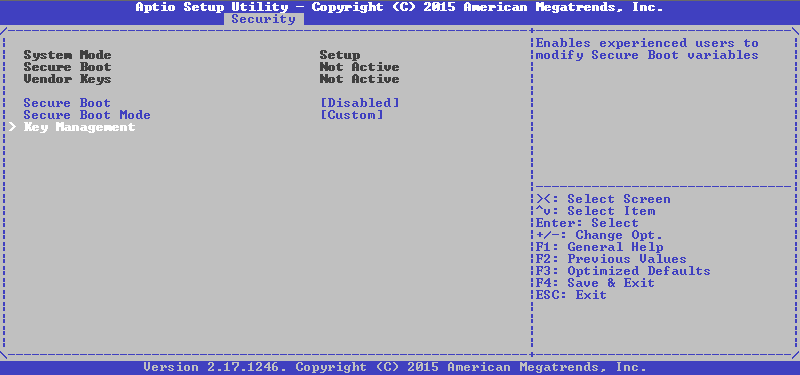

Go to the Key Management (before it was in the same tab, now it is available in a separate) menu and see there the following: 

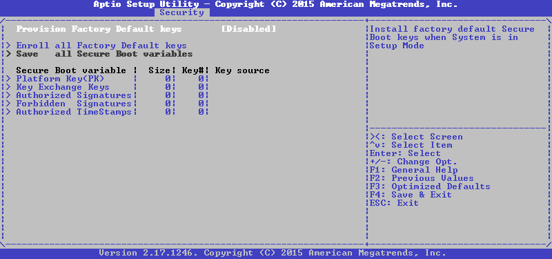

Choose the variable we need, after which they first offer to choose between installing a new key and adding to the existing ones, select the first:

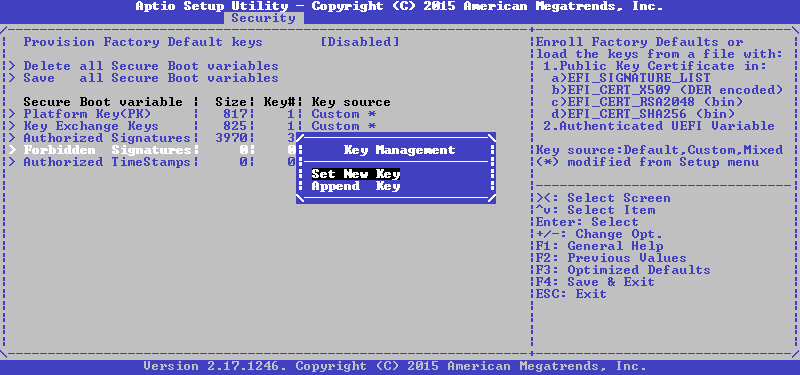

Now it is proposed to either set the default value, or load our own from the file, select the last:

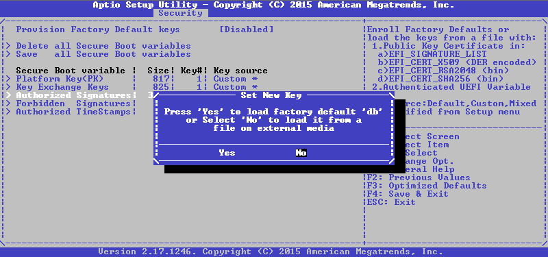

Next, you need the device and the file on it, and then select the format of this file, in our case it is Authenticated Variable: 

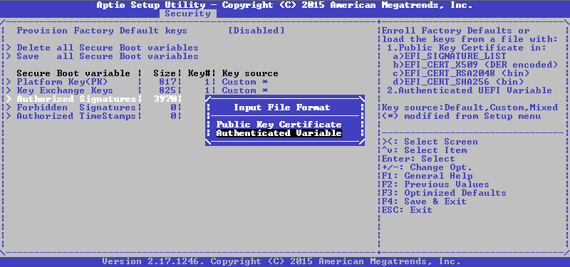

Then you need to confirm the update of the file, and if everything went well before, as a result we will get a concise message:

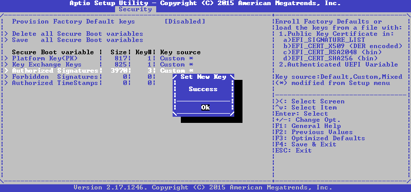

We repeat the same for KEK and PK, and we will get the following state at the exit: 

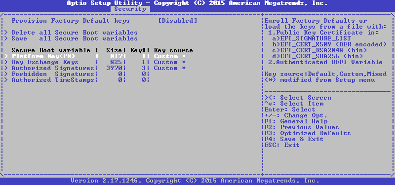

That's right, we have a single PK, only one key in KEK and three keys in db, return to the previous menu with the Esc button and turn on SecureBoot: 

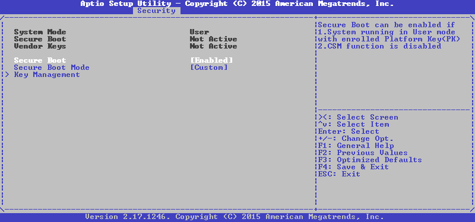

Done, save settings and exit with a reboot, after which we try to boot from our flash drive and see the following picture: 

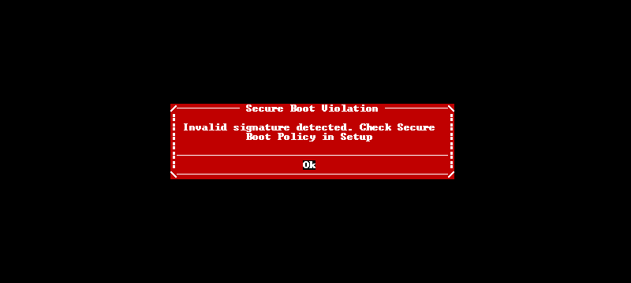

Great, unsigned loaders go through the forest, it remains to check the signed one. We insert another flash drive, reboot and see something like this: 

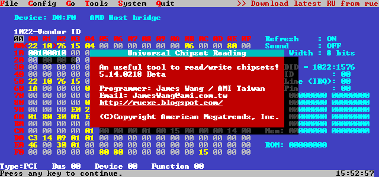

Now we can say that SecureBoot is working as it should. 
If your AMI UEFI does not have such an interface for adding keys, then another method will suit you, which will be discussed later.

### Insyde H2O

Here everything is somewhat worse than in the previous case. There is no interface for adding your own keys, and there are only three options for configuring SecureBoot: either delete all variables at once by switching SecureBoot to Setup Mode, or select an executable file whose hash will be added to the db, and it can be run even if if it is not signed at all, or return to the standard keys, which are PK from Acer on this machine, by the key from Acer and MS in KEK and a bunch of everything from Acer and MS in db. 
However, there is no interface - well, to hell with it, we have KeyTool for thisis, the main thing is that you can go to Setup Mode. Interestingly, the BIOS Setup does not include SecureBoot, if the password Supervisor Password is not set, so install it first, and then perform the erase key: 

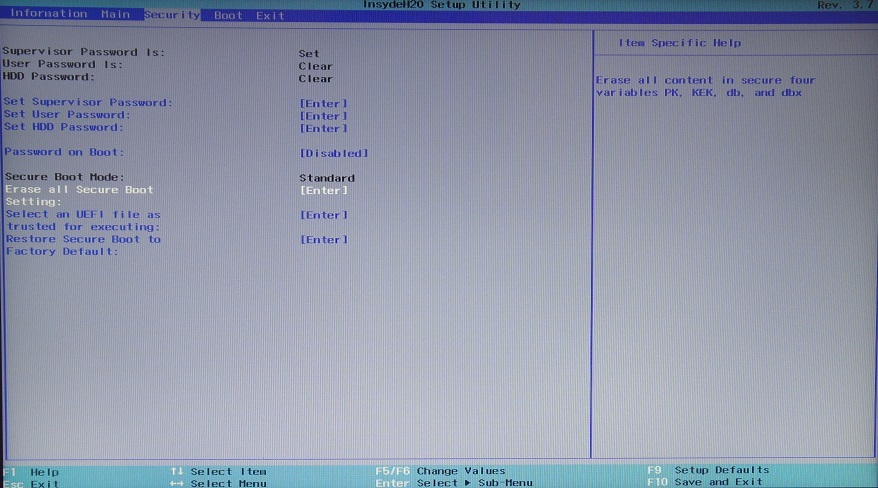

Then on the next tab, select the Boot UEFI boot mode and turn SecureBoot: 

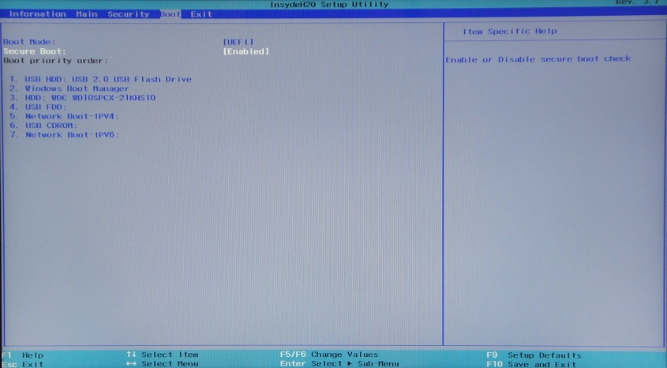

Because my photos in the middle of the night turn out to be unbearably disgusting, then KeyTool screenshots will be taken on the previous system, and you will have to believe that everything looks exactly the same on this one (I swear by my mom!). We boot
from our media into KeyTool , and we see something like the following: 

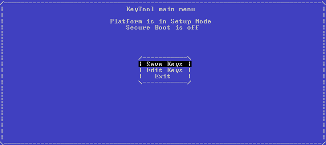

Select Edit Keys, get to the storage selection menu: 

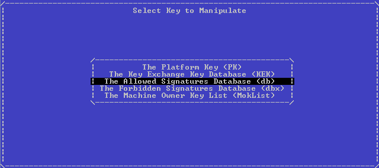

First, select db, then Replace Keys, then our USB device, and then the file: 


Press Enter and without any success messages we are again shown the storage selection menu. We repeat the same first for KEK, and then for PK, then exit to the main menu by double-clicking on Esc. We turn off the machine, turn it on again, try to load KeyTool again and see the following picture (which I dragged from the firmware dump, its photo on the glossy screen is even more nightmarish than the previous ones):


### Phoenix SCT

There are even fewer possibilities here, and in the entire Secure Boot Configuration menu on the Security tab there are only two items: return to standard keys and delete all keys with the system transfer to SetupMode, we need just the second: 

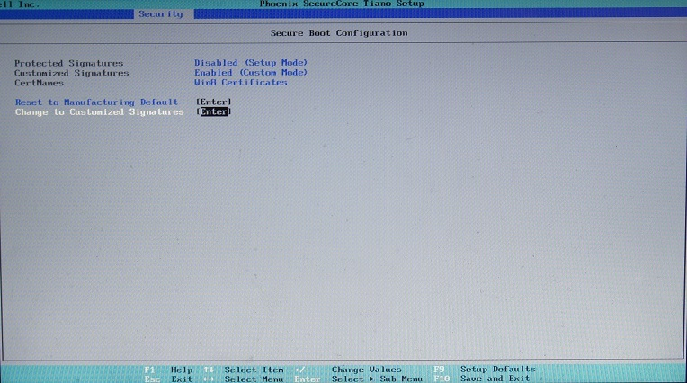

Then on the Boot tab you need to select the UEFI boot type, enable SecureBoot, and create a boot record for KeyTool , otherwise it will not work on this platform: 

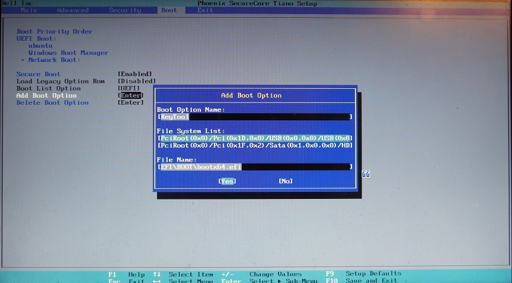

Press Yes, exit with saving changes, reboot, press F12 when loading to get to the boot menu, from there select KeyTool , the work with which is described above ... After adding keys and rebooting, an attempt to restart KeyTool 'a ends like this:

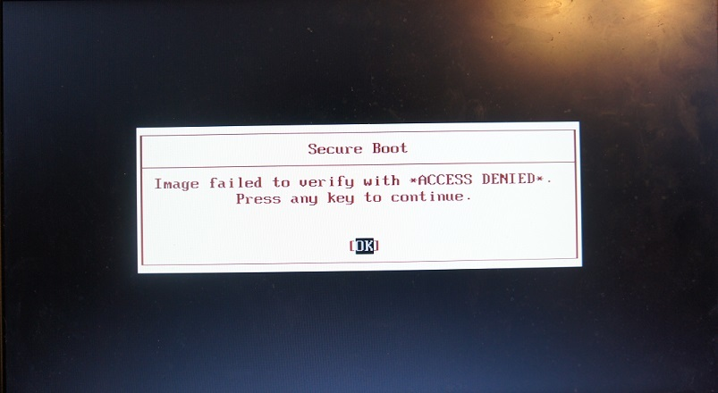


