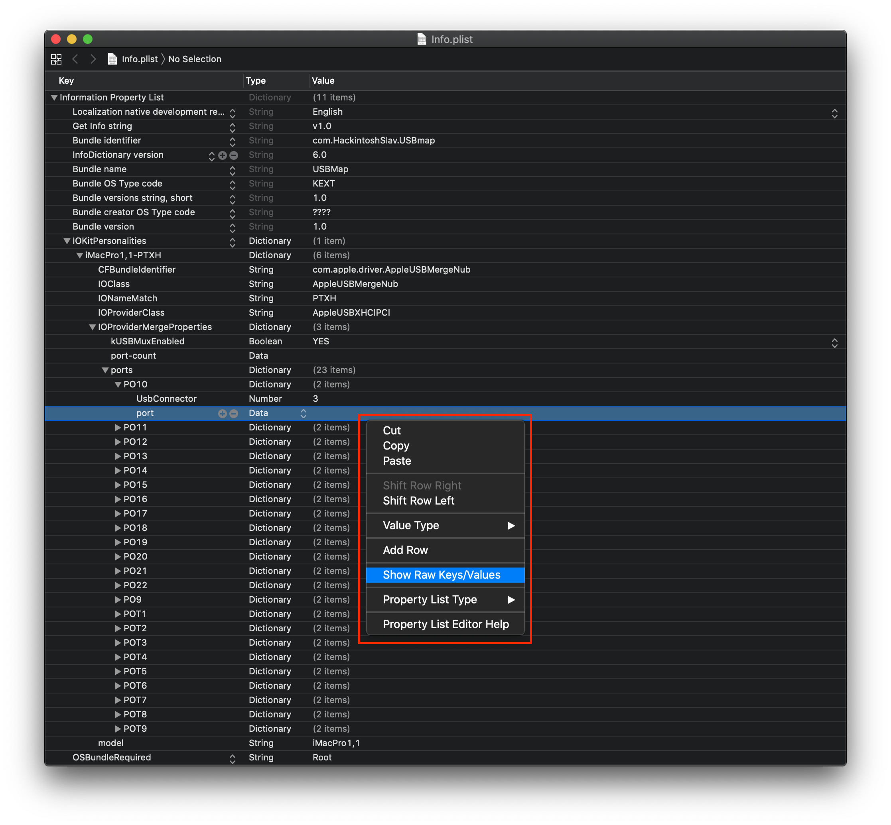
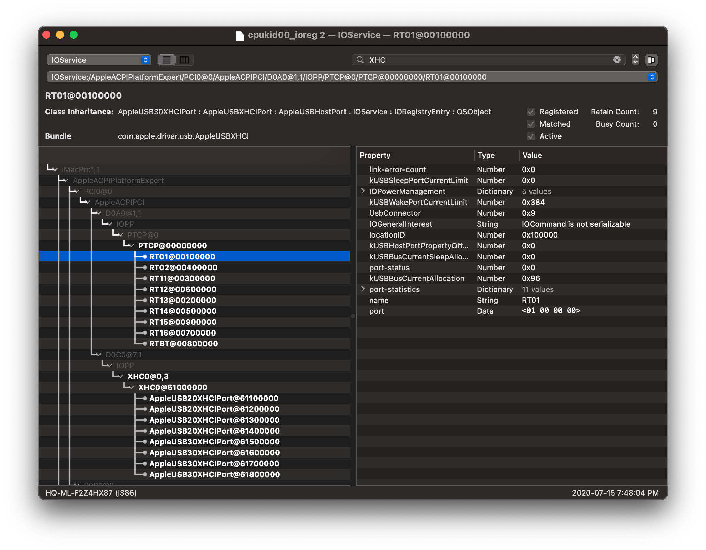
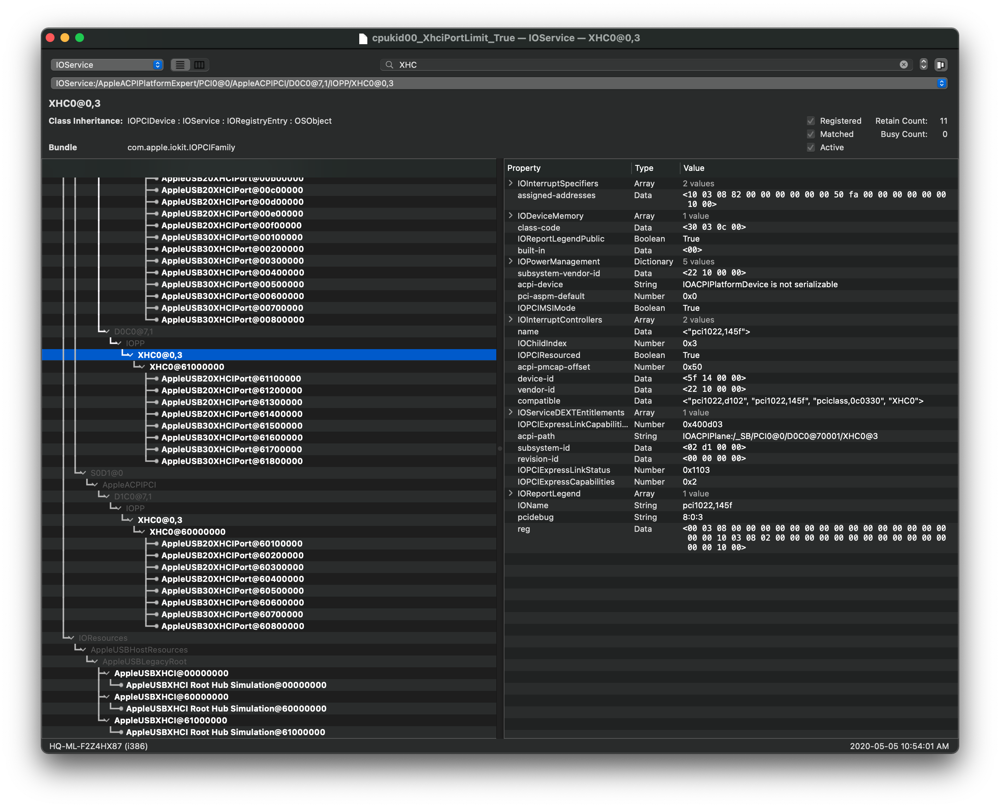
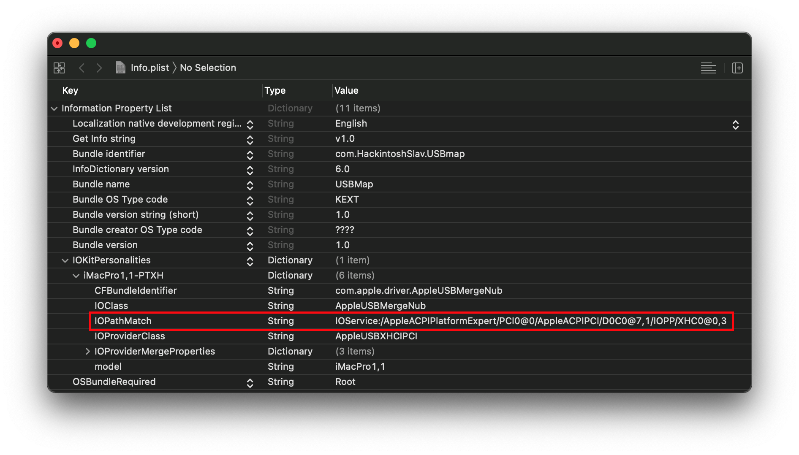
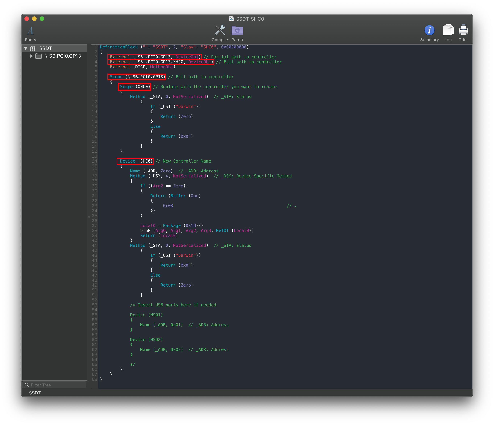

# USB Mapping

Table of Contents:

* [AMD and 3rd Party USB Mapping](#amd-and-3rd-party-usb-mapping)
* [Creating the map](#creating-the-map)
* [Port mapping on screwed up DSDTs](#port-mapping-on-screwed-up-dsdts)
* [Port mapping when you have multiple of the same controller](#port-mapping-when-you-have-multiple-of-the-same-controller)

So with the prerequisites out of the way, we can finally get to the meat of this guide. And now we get to finally read one of my favorite books before I go to bed each night: [The Advanced Configuration and Power Interface (ACPI) Specification!](https://uefi.org/sites/default/files/resources/ACPI_6_3_final_Jan30.pdf)

Now if you haven't read through this before(which I highly recommend you do, it's a thrilling tale), I'll point you to the meat of the USB situation:

* Section 9.14: _UPC (USB Port Capabilities)

Here we're greeted with all the possible USB ports in ACPI:

| Type | Info | Comments |
| :--- | :--- | :--- |
| 0 | USB 2.0 Type-A connector | This is what macOS will default all ports to when no map is present |
| 3 | USB 3.0 Type-A connector | 3.0, 3.1 and 3.2 ports share the same Type |
| 8 | Type C connector - USB 2.0-only | Mainly seen in phones
| 9 | Type C connector - USB 2.0 and USB 3.0 with Switch | Flipping the device **does not** change the ACPI port |
| 10 | Type C connector - USB 2.0 and USB 3.0 without Switch | Flipping the device **does** change the ACPI port. generally seen on 3.1/2 motherboard headers |
| 255 | Proprietary connector | For Internal USB ports like Bluetooth |

## AMD and 3rd Party USB Mapping

The steps are quite simple:

* Read this guide
* Cry a bit
* Cry some more
* Buy some Intel hardware
* Return said hardware
* Gather courage to USB map on AMD
* Read the rest of the guide *again* and actually USB map

## Creating the map

So to start off, open [IORegistryExplorer](https://github.com/khronokernel/IORegistryClone/blob/master/ioreg-302.zip) and find the USB controller you'd wish to map. For controllers, they come in some variations:

* XHC
* XHC0
* XHC1
* XHC2
* XHCI
* XHCX
* AS43
* PTXH (Commonly associated with AMD Chipset controllers)
* PTCP (Found on AsRock X399, in ACPI these ports are actually called PXTX but macOS will enumerate them differently)
* PXSX(This is a generic PCIe device, **double check it's a USB device**)

The best way to find controllers is by searching for `XHC` and then looking at the results that come up, the parent of all the ports is the USB controller. Do note that many boards have multiple controllers but the port limit is per controller.

For today's example, we'll be both adding missing ports and getting under the 15 port limit for this X399 chipset which has the identifier `PTXH`


As you can see from the photo above, we're missing a shit ton of ports! Specifically ports POT3, POT4, POT7, POT8, PO12, PO13, PO15, PO16, PO17, PO18, PO19, PO20, PO21, PO22!

So how do we fix this? Well if you look in the corner you'll see the `port` value. This is going to be important to us when mapping

Next, let's take a peek at our DSDT and check for our `PTXH` device with [maciASL](https://github.com/acidanthera/MaciASL/releases):

Top of PTXH             |  Bottom of PTXH
:-------------------------:|:-------------------------:
  |   

All of our ports are here! So why in the world is macOS hiding them? Well there's a couple of reasons but this being the main: Conflicting SMBIOS USB map

Inside the `AppleUSBHostPlatformProperties.kext` you'll find the USB map for most SMBIOS, this means that that machine's USB map is forced onto your system.

Well to kick out these bad maps, we gotta make a plugin kext. For us, that's the [AMD-USB-Map.kext](https://github.com/dortania/USB-Map-Guide/tree/master/extra-files/AMD-USB-Map.kext.zip)

Now right-click and press `Show Package Contents`, then navigate to `Contents/Info.plist`


If the port values don't show in Xcode, right click and select `Show Raw Keys/Values`


So what kind of data do we shove into this plist? Well, there are a couple of sections to note:

* **Model**: SMBIOS the kext will match against, set this up to what SMBIOS you are currently using
* **IONameMatch**: The name of the controller it'll match against, in this example we'll use `PTXH`
  * IOPathMatch is another entry you can use instead, if you have multiple controllers with the same name(ie. 2 XHC0)
* **port-count**: The last/largest port value that you want to be injected
* **port**: The address of the USB controller
* **UsbConnector**: The type of USB connector, which can be found on the [ACPI 6.3 spec, section 9.14](https://uefi.org/sites/default/files/resources/ACPI_6_3_final_Jan30.pdf)

> How do I know which ports are 2.0 and which are 3.0?

Well, the easiest way is grabbing a USB 2.0 and USB 3.0 device, then write down which ports are are what type from observing IOReg.

* **Remember**: USB 3.0 ports have dual personalities, so you **must** test both a 2.0 drive and 3.0 to know which ports are associated with it in IOReg.

Now, let's take this section:

```
Device (PO18)
   {
   Name (_ADR, 0x12) // _ADR: Address
   Name (_UPC, Package (0x04) // _UPC: USB Port Capabilities
      {
         Zero,
         0xFF,
         Zero,
         Zero
      })
   }
```

For us, what matters is the `Name (_ADR, 0x12) // _ADR: Address` as this tells us the location of the USB port. This value will be turned into our `port` value on the plist. Some DSDTs don't declare their USB address, for these situations we can see their IOReg properties.


**Reminder**: Don't drag and drop the kext, read the guide carefully. Rename `IONameMatch` value to the correct controller you're wanting to map and verify that the ports are named correctly to **your DSDT**. If you could drag and drop it and have it work for everyone there wouldn't be a guide ;p

Now save and add this to both your kext folder and config.plist then reboot!

Now we can finally start to slowly remove unwanted ports from the Info.plist and remove the `XhciPortLimit` quirk once you have 15 ports total or less per controller.

## Port mapping on screwed up DSDTs

Something you may have noticed is that your DSDT is even missing some ports, like for example:


In this DSDT, we're missing HS02, HS03, HS04, HS05, etc. When this happens, we actually need to outright remove all our ports from that controller in our DSDT. What this will let us do is allow macOS to build the ports itself instead of basing it off of the ACPI. Save this modified DSDT.aml and place it in your EFI/OC/ACPI folder and specify it in your config.plist -> ACPI -> Add(note that DSDT.aml must be forced to work correctly)

## Port mapping with generic `AppleUSB20XHCIPort`/'AppleUSB30XHCIPort

An odd issue with some OEM's ACPI is that they never actually define or properly name the USB ports. And so when macOS's IOService starts scanning and building the ports, they're given a generic name. This makes it difficult to really know where your ports are.

To resolve this, we can simply add names with our USBmap.kext, this is thanks to us mathcing the USB map based off of the USB port's location instead of by name. 

So before you USB map, you'll get something like this:


With our map, your kext should look something like this:


And the end result once the map is applied:



## Port mapping when you have multiple of the same controller

This becomes a problem when we run systems with many USB controllers which all want to have the same identifier, commonly being multiple XHC0 devices or AsMedia controllers showing up as generic PXSX devices. To fix this, we have 3 options:

* IOPathMatch property
* ACPI Rename (won't be covered in this guide, see ACPI section of OpenCore's configuration.pdf)
* SSDT Recreation

### IOPathMatch property

Actually quite simple, grab the sample USBmap.kext we provided earlier and look for the IONameMatch Property. Now rename this to IOPathMatch.

Finally, grab IOreg and look for your USB controller:



From here, pay very close attention to which actual device I selected. Specifically the child of of `XHC0@0,3` being `XHC0@61000000`, reason for this is that's our Root-hub(or what macOS uses to enumerate ports) The child with the same name is actually a root hub but does not concern us

Now copy the `XHC0@61000000` entry and paste it back into the `IOPathMatch` entry in our USBmap.kext's info.plist, this should result in quite a long path name:

```
IOService:/AppleACPIPlatformExpert/S0D1@0/AppleACPIPCI/D1C0@7,1/IOPP/XHC0@0,3/XHC0@61000000
```

And once done your USBmap's IOPathMatch should look like this:



### SSDT Recreation

With the SSDT Recreation method, what we'll be doing is "renaming" the device but in reality creating a brand new device just for macOS that is in the exact same spot as your old USB controller.

To do this, grab the following SSDT:

* [SSDT-SHC0.dsl](https://github.com/dortania/USB-Map-Guide/tree/master/extra-files/SSDT-SHC0.dsl)

What you'll want to do is find a controller you want to rename, find its full ACPI path and replace the one in the sample SSDT. In our sample, we're be renaming `PCI0.GP13.XHC0` to `SHC0` so change accordingly.



**Note**: In rare cases, macOS isn't able to properly rebuild the USB ports with the new "fake" USB controller. In these situations we need to manually add ports to it that are present in the original controller(ie. HS01, HS02, POT1, etc)

> But how do I map a non-standard controller that shows up as PXSX?

Similar idea to regular SSDT renaming except you need to actually find the controller. This becomes difficult as SSDs, network controllers, and other generic PCIe devices can also show up as PXSX. Check the ACPI-path in IOreg to find its path:


As we can see, `IOACPIPlane:/_SB/PC00@0/RP05@1c0004/PXSX@0` would be interpreted as `SB.PC00.RP05.PXSX`

And so from the above SSDT, we change the following:

* `External (_SB_.PCI0.GP13, DeviceObj)` -> `External (_SB_.PC00.RP05, DeviceObj)`
* `External (_SB_.PCI0.GP13.XHC0, DeviceObj)` -> `External (_SB_.PC00.RP05.PXSX, DeviceObj)`
* `Scope (\_SB.PCI0.GP13)` -> `Scope (\_SB.PC00.RP05)`
* `Scope (XHC0)` -> `Scope (PXSX)`
