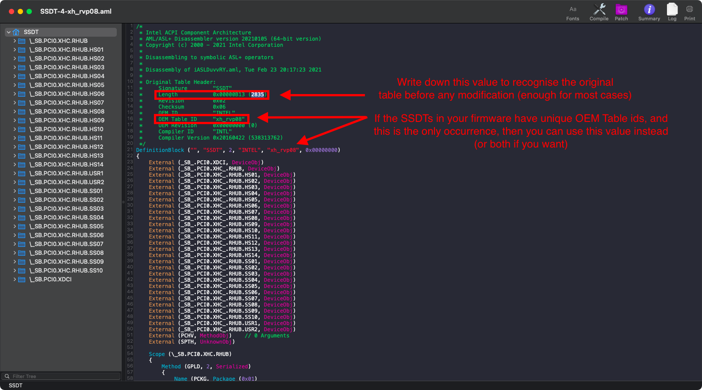
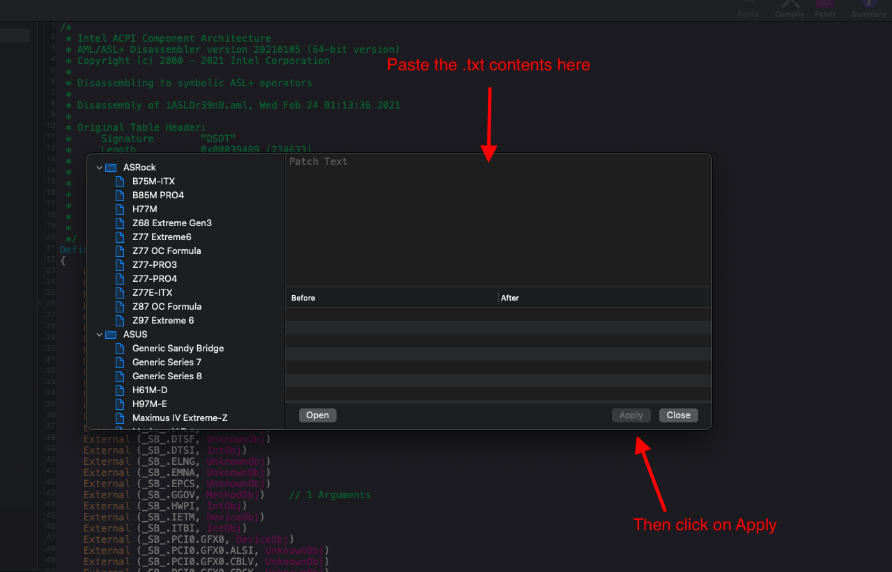

# USB Mapping

So with the prerequisites out of the way, we can finally get to the meat of this guide. And now we get to finally read one of my favorite books before I go to bed each night: [The Advanced Configuration and Power Interface (ACPI) Specification!](https://uefi.org/sites/default/files/resources/ACPI_6_3_final_Jan30.pdf)

Now if you haven't read through this before(which I highly recommend you do, it's a thrilling tale), I'll point you to the meat of the USB situation:

* Section 9.14: _UPC (USB Port Capabilities)

Here we're greeted with all the possible USB ports in ACPI:

| Type | Info | Comments |
| :--- | :--- | :--- |
| 0 | USB 2.0 Type-A connector | This is what macOS will default all ports to when no map is present |
| 3 | USB 3.0 Type-A connector | 3.0, 3.1 and 3.2 ports share the same Type |
| 8 | Type C connector - USB 2.0-only | Mainly seen in phones
| 9 | Type C connector - USB 2.0 and USB 3.0 with Switch | Flipping the device **does not** change the ACPI port |
| 10 | Type C connector - USB 2.0 and USB 3.0 without Switch | Flipping the device **does** change the ACPI port. generally seen on 3.1/2 motherboard headers |
| 255 | Proprietary connector | For Internal USB ports like Bluetooth |

## USB Mapping: The manual way

This section is for those who want to get down into the meats of their hackintosh, to really understand what it's doing and help if there's any issues with USBmap.py and other mapping tools. To start, we'll need a few things:

* Installed version of macOS
  * This is due to how macOS enumerates ports, trying to map from other OSes makes this difficult
  * Note: This guide will be focusing on OS X 10.11, El Capitan and newer. Older OSes shouldn't require any USB mapping
* Non-conflicting USB names
  * See previous section: [Checking what renames you need](../system-preparation.md#checking-what-renames-you-need)
* A USB 2.0 and USB 3.0 device to test with
  * You must have 2 separate devices as to ensure no mix ups with personalities
* [IORegistryExplorer.app](https://github.com/khronokernel/IORegistryClone/blob/master/ioreg-302.zip)
  * To view the inner workings of macOS more easily
  * If you plan to use Discord for troubleshooting, [v2.1.0](https://github.com/khronokernel/IORegistryClone/blob/master/ioreg-210.zip) is a bit easier on file size.
* [USBInjectAll](https://bitbucket.org/RehabMan/os-x-usb-inject-all/downloads/)
  * This is only required for older USB controllers like Broadwell and older, however some Coffee Lake systems may still require it
  * **Reminder** this kext does not work on AMD
* [Sample-USB-Map.kext](https://github.com/dortania/OpenCore-Post-Install/blob/master/extra-files/Sample-USB-Map.kext.zip)
* [ProperTree](https://github.com/corpnewt/ProperTree)
  * Or any other plist editor
  
Now with all this out of the way, lets get to USB mapping!

## Finding your USB ports

Lets open our previously downloaded [IORegistryExplorer.app](https://github.com/khronokernel/IORegistryClone/blob/master/ioreg-302.zip) and search for our USB controller(s).

The 2 main search terms are `XHC` and `EHC`, but if you have a legacy board with UHCI or OHCI controllers you'll need to adjust. A blanket `USB` search may show too many entries and confuse you.

For this example, lets try and map an Asus X299-E Strix board:


From the above image we can see 3 USB controllers:

* PXSX(1, Top)
* PXSX(2, Middle)
* XHCI(3, Bottom)

Pay attention that they're individual controllers, as this means **each USB controller has it's own port limit**. So you're not as starved for USB ports as you may think.

Now I personally know which USB controllers match up with which physical ports, problem is it's not always as obvious which ports match with which controllers. So lets try to figure out which is what.

**Note**: The AppleUSBLegacyRoot entry is an entry that lists all active USB controllers and ports, these are not USB controllers themselves so you can outright ignore them.

**Note 2**: Keep in mind every motherboard model will have a unique set of port combos, controller types and names. So while our example uses PXSX, yours might have the XHC0 or PTCP name. And quite common on older motherboards is that you may only have 1 controller, this is alright so don't stress about having the exact same setup as the example.

Common names you can check:

* USB 3.x controllers:
  * XHC
  * XHC0
  * XHC1
  * XHC2
  * XHCI
  * XHCX
  * AS43
  * PTXH
    * Commonly associated with AMD Chipset controllers
  * PTCP
    * Found on AsRock X399
  * PXSX
    * This is a generic PCIe device, **double check it's a USB device** as NVMe controllers and other devices can use the same name.
* USB 2.x controllers:
  * EHCI
  * EHC1
  * EHC2
  * EUSB
  * USBE

### Finding which ports match with which controller

To start, I'm going to plug a USB device into my front USB 3.1(Type-A) and 3.2(Type-C):


Next lets look at IOReg, and we can see where our USB devices fell:

| USB-C | USB-A |
| :--- | :--- |
|  |  |

Here we see a few things:

* Front 3.2 Type-C is on the PXSX(2, middle) Controller
* Front 3.1 Type-A is on the XHCI(3, Bottom) Controller

Now that we have an idea of which ports go to which controller, can can now look into how we USB map.

### USB-A mapping

As mentioned before, USB 3.x ports are split into 2 personalities: USB 2.0 and USB 3.0. This is to ensure backwards compatibility but macOS itself has difficulties determining which personalities match up to which ports. That's where we come in to help.

So lets take our USB-A port, when we plug in a USB 3.0 device into it we see `XHCI -> SS03` light up. This is the USB 3.0 personality of the port. Now we'll want to plug a USB 2.0 device into that port:

| 3.0 Personality | 2.0 Personality |
| :--- | :--- |
|  |  |

We see that the USB 2.0 personality of our 3.0 port is `XHCI -> HS03`, now you should be able to get an idea of what we're trying to do:

* Front Type-A:
  * HS03: 2.0 Personality
  * SS03: 3.0 Personality

**Note**: If your USB ports show up as either AppleUSB20XHCIPort or AppleUSB30XHCIPort, you can still map however it will be a bit more difficult. Instead of writing down the names, pay very close attention to the `port` property on the right hand side:


### Creating a personal map

This is where we pull out pen and paper, and start to write down which ports physically match up with which digital ports. An example of what your map can look like:

| Name Mapping | Property Mapping |
| :--- | :--- |
|  |  |

Your own map doesn't need to look exactly like this, however you'll want something that you can easily understand and refer to down the line.

Note:

* Name Mapping: When a proper name shows up in IOReg(ie. HS01)
* Property Mapping: When no proper name is given(ie. AppleUSB30XHCIPort)

### USB-C mapping

Next lets map our USB-C port, this is where it gets quite tricky as you may have noticed earlier:

| Type | Info | Comments |
| :--- | :--- | :--- |
| 8 | Type C connector - USB 2.0-only | Mainly seen in phones |
| 9 | Type C connector - USB 2.0 and USB 3.0 with Switch | Flipping the device **does not** change the ACPI port |
| 10 | Type C connector - USB 2.0 and USB 3.0 without Switch | Flipping the device **does** change the ACPI port. generally seen on 3.1/2 motherboard headers |

So when we map our USB-C header, we notice it occupies the SS01 port. But when we flip it, we actually populate it on the SS02 port. When this happens, you'll want to write this down for when we apply the port type.

* Note: All personalities from this port will be put under the Type 10
* Note 2: Not all USB-C headers will be Type 10, **double check yours**


### Continuing mapping

Now that you have the basic idea, you'll want to go around with every USB port and map it out. This will take time, and don't forget to write it down. Your final diagram should look similar to this:


### Special Notes

* [Bluetooth](#bluetooth)
* [USRx Ports](#usrx-ports)
* [Missing USB Ports](#missing-usb-ports)

#### Bluetooth

So while not obvious to many, Bluetooth actually runs over the USB interface internally. This means that when mapping, you'll need to pay close attention to devices that already show up in IOReg:


Keep this in mind, as this plays into the Type 255 and getting certain services like handoff working correctly.

#### USRx Ports

When mapping, you may notice some extra ports left over, specifically USR1 and USR2. These ports are known as "USBR" ports, or more specifically [USB Redirection Ports](https://software.Intel.com/content/www/us/en/develop/documentation/amt-developer-guide/top/storage-redirection.html). Use of these is for remote management but real Macs don't ship with USBR devices and so has no support for them OS-wise. You can actually ignore these entries in your USB map:


#### Missing USB ports

In some rare situations, certain USB ports may not show up in macOS at all. This is likely due to a missing definition in your ACPI tables, and so we have a few options:

* Coffee Lake and older should use [USBInjectAll](https://github.com/Sniki/OS-X-USB-Inject-All/releases)
  * Don't forget to add this to both EFI/OC/Kexts and you config.plist's kernel -> Add
* Comet Lake and newer should use SSDT-RHUB
* AMD systems should also use SSDT-RHUB

SSDT-RHUB's purpose is to reset your USB controller, and force macOS to reenumerate them. This avoids the hassle of trying to patch your existing ACPI tables.

To create your own SSDT-RHUB-MAP:

* Grab a copy of the SSDT: [SSDT-RHUB.dsl](https://github.com/dortania/Getting-Started-With-ACPI/blob/master/extra-files/decompiled/SSDT-RHUB.dsl)
* Grab [maciASL](https://github.com/acidanthera/MaciASL/releases/tag/1.5.7)

Next, open our newly downloaded SSDT with maciASL, you should be presented with the following:


Now, open IOReg and find the USB controller you want to reset(pay very close attention its the USB controller and not the child RHUB with the same name):

If you look to the right side, you should see the `acpi-apth` property. Here we're going to need to translate it to something our SSDT can use:

```sh
# before modifying
IOService:/AppleACPIPlatformExpert/PC00@0/AppleACPIPCI/RP05@1C,4/IOPP/PXSX@0
```

Now we'll want to strip out any unnecessary data:

* `IOService:/AppleACPIPlatformExpert/`
* `@##`
* `IOPP`

Once cleaned up, yours should look similar:

```sh
# After modifying
PC00.RP05.PXSX
```

Following the example from above, we'll be renaming `PCI0.XHC1.RHUB` to `PC00.RP05.PXSX.RHUB`:

**Before**:

```
External (_SB_.PCI0.XHC1.RHUB, DeviceObj) <- Rename this

Scope (_SB.PCI0.XHC1.RHUB) <- Rename this
```


Following the example pathing we found, the SSDT should look something like this:

**After**:

```
External (_SB.PC00.RP05.PXSX.RHUB, DeviceObj) <- Renamed

Scope (_SB.PC00.RP05.PXSX.RHUB) <- Renamed
```


Once you've edited the SSDT to your USB controller's path, you can export it with `File -> SaveAs -> ACPI Machine Language Binary`:


Finally, remember to add this SSDT to both EFI/OC/ACPI and your config.plist under ACPI -> Add.

## Option 1: SSDT method

A little bit of history worth to mention:

* Thanks to [Gengik84](https://www.macos86.it/profile/1-gengik84/) and the [macos86.it community](https://www.macos86.it/topic/9-mappatura-porte-usb/) for developing and testing this quick and easy method, the original post dates back to 2018.

* Shame on Maldon [who stole it later in 2019](https://www.olarila.com/topic/6181-guide-native-usb-fix-for-desktops-no-injectorkext-required-skylake/) without mentioning any credits

Prerequisites:

* This guide assumes that the user knows how to use MaciASL, IORegistryExplorer and ProperTree. We'll use a sample motherboard, the ASUS Z370 Prime A II where the USB devices are described in the `SSDT_xh-rvp08.aml`. 
* Use OpenCore's `SysReport` feature to look where your OEM put the definitions for your USB devices in the ACPI tables (if none found in the SSDTs, your last chance should be your DSDT)

Before any modification, write down the `Length` value which is located in the beginning of the file, as shown: 
 
  

The unmodified, original ACPI table has a lenght of `2835`, this is going to be useful later in the guide, when we're going to tell OpenCore to avoid loading that table in favour of the new one we're going do modify.

Let's start by adding the `GENG` method that can be found in MaciASL's Patch menu or this [link](https://github.com/1alessandro1/OpenCore-Post-Install/blob/master/extra-files/UsbConnectorTypePatch.txt)

Copy paste the whole contents of the file to MaciASL's `Patch text` as shown:



**Note: At this point, this section assumes that the user already discovered how to track every single type and kind of port in your system using 2.0 and 3.0 USB devices.**

After applying your patch look for the first USB 2.0 personality in your list (from the discovering process explained before).

And we find that the OEM (ASUS) already defined its own `GUPC` method to mark that port as `One` (Enabled) unconditionally, even if that port may not respond to us when tested in IORegistryExplorer.

  
  
  According to the Advanced Configuration and Power Interface (ACPI) Specification, version 6.3, at page [673](https://uefi.org/sites/default/files/resources/ACPI_6_3_May16.pdf#page=673), the `_UPC`  method has these possible values for the `Return` function:

```
Return Value Information:
    Package {
    Connectable // Integer (BYTE)
    Type // Integer (BYTE)
    Reserved0 // Integer
    Reserved1 // Integer)
}
```
Where:

  * `Connectable` is a boolean port which disables/enables the USB port (0/1, respectively)
  * `Type` identifies the shape of the port (e.g. Type-A is rectangular)


## Applying the necessary changes for the discovered ports

* **For USB 2.0 personality ports**: located on the back panel, the Type value is `0x00` or `Zero`:

    ```
    Scope (\_SB.PCI0.XHC.RHUB.HS01) // <-- Your port may differ (in this case is HS01)
    {
        Method (_UPC, 0, NotSerialized)  // _UPC: USB Port Capabilities
        {
            Return (GENG (One, 0x00)) // <-- This is the modification required
        }

        Method (_PLD, 0, NotSerialized)  // _PLD: Physical Location of Device
        {
            Return (GPLD (One, One))
        }
    }
    ```

    Where the first parameter `One` refers to an active port, while `0x00` or `Zero` stands for connector type (2.0 as described in ACPI spec mentioned earlier). 
    

* **USB 3.0 personality ports**: located on the back panel, the Type value is `0x03` (or in some cases `0x07`, usually found on laptops if a battery logo is next to the 3.0 personality USB-A port):   

```
    Scope (\_SB.PCI0.XHC.RHUB.SS01) // <-- Your port may differ (in this case is SS01)
    {
        Method (_UPC, 0, NotSerialized)  // _UPC: USB Port Capabilities
        {
            Return (GENG (One, 0x03)) // <-- This is the modification required
        }

        Method (_PLD, 0, NotSerialized)  // _PLD: Physical Location of Device
        {
            Return (GPLD (DerefOf (USSD [Zero]), One))
        }
    }
```
* **Internal ports**: here port speed does not matter when it comes to editing the `Return` value (an internal 2.0 port is not different from a 3.0 port since it's recognized as an internal "proprietary" connector). Also, the realm of internal ports is vast, and you can't go wrong if you recognize them as non-external ports since you know those are the ones present **only** in the *back panel*, treating every other *active* port as internal. It's worth to mention some of the most recurrent `Internal` ports: 

    * Front panel ports are wired to an internal connector to the motherboard
    * Bluetooth devices are internal USB devices
    * Webcams in laptops  

    Example:

```
    Scope (\_SB.PCI0.XHC.RHUB.HS07) // <-- Your port may differ (in this case is HS07)
    {
        Method (_UPC, 0, NotSerialized)  // _UPC: USB Port Capabilities
        {
            Return (GENG (One, 0xFF)) // <-- This is the modification required
        }

        Method (_PLD, 0, NotSerialized)  // _PLD: Physical Location of Device
        {
            Return (GPLD (DerefOf (UHSD [0x06]), 0x07))
        }
    }
```

* **Inactive ports**: For every other USB port which couldn't be found in the discovery process in IORegistryExplorer, you can return `GENG (Zero)`or keep the same method with `GUPC (Zero)`.

    * First approach *(always correct, because the GENG method has already been defined)*:
    ```
        Scope (\_SB.PCI0.XHC.RHUB.SS02) // <-- Your port may differ (in this case is SS02)
        {
            Method (_UPC, 0, NotSerialized)  // _UPC: USB Port Capabilities
            {
                Return (GENG (Zero)) // <-- This is the modification required if you want to use the GENG method
            }

            Method (_PLD, 0, NotSerialized)  // _PLD: Physical Location of Device
            {
                Return (GPLD (DerefOf (USSD [Zero]), One))
            }
        }
    ```
    * Second approach *(OEM dependant, only modifies the value in the parenthesis)*:
    ```
        Scope (\_SB.PCI0.XHC.RHUB.SS01) // <-- Your port may differ (in this case is SS01)
        {
            Method (_UPC, 0, NotSerialized)  // _UPC: USB Port Capabilities
            {
                Return (GUPC (Zero)) // <-- If you want to keep your OEM method for disabling the port
            }

            Method (_PLD, 0, NotSerialized)  // _PLD: Physical Location of Device
            {
                Return (GPLD (DerefOf (USSD [Zero]), One))
            }
        }
    ```

Once you've defined every port using these criterias, go to *File > Save As...*


Remember to add this SSDT to both EFI/OC/ACPI and your config.plist under ACPI -> Add.

* **Note: It is required to block the original OEM Table Lenght / OEM Table id to the ACPI -> Block section:**

  Open your config.plist, use the [ProperTree](https://github.com/corpnewt/ProperTree) and you should do these last tweaks:

  * Use the OC snapsphot feature to add the edited USB SSDT name in your `ACPI > Add` section
  * We also have to tell OpenCore to block the unmodified one hardcoded in our ACPI by specifing the `TableLenght` value in `config.plist/ACPI/Block` 
  * The `TableSignature` value has to be filled converting the word `SSDT` from ASCII to hex
  * Set your (Optional) `OemTableid` converting your SSDT table ASCII value (in our case, `xh_rvp08`) to hex


* Note: Some firmware may use the same name (`OemTableId`) for different SSDTs, (e.g. Gigabyte and some MSI boards). This is why we recommend to check the `TableLenght` value to ensure proper blocking of the correct table and to avoid dropping unwanted ACPI tables, if you found that at least two SSDTs have the same `TableId` name you can empty the `OemTableId` field in and only use `TableLength`.


Save the config.plist, and reboot.

## Option 2:Creating our kext

Its the time you've all been waiting for, we finally get to create our USB map!

First off, we'll want to grab a sample USB map kext:

* [Sample-USB-Map.kext](https://github.com/dortania/OpenCore-Post-Install/blob/master/extra-files/Sample-USB-Map.kext.zip)

Next right click the .kext, and select `Show Package Contents`. then drill down to the info.plist:

| Show Contents | info.plist |
| :--- | :--- |
|  |  |

Now lets open ProperTree and look at this info.plist:


Here we see a few sections, under `IOKitPersonalities`:

* RP05 - PXSX(1)
* RP07 - PXSX(2)
* XHCI - XHCI

Each entry here represents a USB controller, specifically the map for each controller. The names of the entry don't matter much however, it's more for book keeping so you know which entry to has which USB map.

Next lets head into the `RP05 - PXSX(1)` entry:


Here we see a few more important properties:

| Property | Comment |
| :--- | :--- |
| IOPathMatch | The device macOS will choose to attach the map to |
| IOProviderClass | The USB driver macOS will choose to attach |
| model | The SMBIOS the USB map attaches too|
| IOProviderMergeProperties | The dictionary holding the actual port map |

### Determining the properties

Determining the value for each property is actually quite straight forward:

* [IOPathMatch](#iopathmatch)
* [IOProviderClass](#ioproviderclass)
* [model](#model)
* [IOProviderMergeProperties](#ioprovidermergeproperties)

#### IOPathMatch

Finding IOPathMatch is super easy, first find the USB controller you want to map and then select the Root HUB(so the PXSX child with the same name as the parent, don't worry it's less confusing when you look at the image):


Now with the PXSX entry selected, simply copy(Cmd+C) and paste it into our info.plist. Your property should look similar to the below:

```
IOService:/AppleACPIPlatformExpert/PC00@0/AppleACPIPCI/RP05@1C,4/IOPP/PXSX@0/PXSX@01000000
```

**Note**: Each USB Controller will have a unique IOPathMatch value, keep this in mind if you have multiple controllers of the same name. This Asus X299 board has 2 PXSX USB controllers, so each new USB map dictionary will have a unique entry for IOPathMatch.

#### IOProviderClass

Finding IOProviderClass is also easy, select the Root-hub once again and look for the CFBundleIdentifier value:

| IOReg | info.plist |
| :--- | :--- |
|  |  |

Now we can't take that value 1-1, instead we need to trim it to the Kext's short name being `AppleUSBXHCIPCI`(So we removed `com.apple.driver.usb.`)

#### model

If you've forgotten what SMBIOS you're using, you can simply check the top level device in IOReg:

| IOReg | info.plist |
| :--- | :--- |
|  |  |

### IOProviderMergeProperties

Now lets open the IOProviderMergeProperties dictionary:


Here we have a lot of data to work through:

| Property | Comment |
| :--- | :--- |
| name | The name of the USB port's dictionary |
| port-count | This is the largest port value you're injecting |
| UsbConnector | This is the type of USB port as mentioned in the ACPI 9.14 section |
| port | The physical location of your USB port in ACPI |
| Comment | An optional entry to help you keep track of all your ports |

And a reminder of all possible port types:

| Type | Info | Comments |
| :--- | :--- | :--- |
| 0 | USB 2.0 Type-A connector | This is what macOS will default all ports to when no map is present |
| 3 | USB 3.0 Type-A connector | 3.0, 3.1 and 3.2 ports share the same Type |
| 8 | Type C connector - USB 2.0-only | Mainly seen in phones
| 9 | Type C connector - USB 2.0 and USB 3.0 with Switch | Flipping the device **does not** change the ACPI port |
| 10 | Type C connector - USB 2.0 and USB 3.0 without Switch | Flipping the device **does** change the ACPI port. generally seen on 3.1/2 motherboard headers |
| 255 | Proprietary connector | For Internal USB ports like Bluetooth |

It should be coming full circle now, as you can see how our previous work with mapping out our ports works.

#### Name

The name property is actually the name of the USB port's dictionary, and is used solely for house keeping. Keep in mind every USB port you want to use needs to have its own unique USB port dictionary.

The name itself holds no value besides showing up in IOReg and so this can be whatever you like. To keep this sane, we use the name already given by our ACPI tables(in this case HS01) but the name can be any 4 character entry. However do not go over this 4 char limit, as unintended side effects can happen.

* Note: Those with AppleUSB20XHCIPort or AppleUSB30XHCIPort names for USB ports, you should choose a name easy to identify. On Intel, this is HSxx for 2.0 personalities and SSxx for 3.0 personalities


#### port

To find the `port` value, simply select your USB port in IOReg and look for the `port` entry:

| IOReg | info.plist |
| :--- | :--- |
|  |  |

From here we get `<03 00 00 00>`, you can simply remove any spaces and add it to your USB map

#### port-count

The final value remaining, look back at your USB map and see which `port` entry is the largest:


Here we see the largest in PXSX(1) is `<04000000>`, do keep in mind that `port` uses hexadecimal if you get any letters in your USB map.

### Continuing on

Now that we've gone over how to map your USB ports for a specific controller, you should have enough understanding to map more controllers. The sample USB-Map.kext I provided has 3 USB controllers listed in it(PXSX-1, PXSX-2 and XHCI). Remember to edit accordingly and to remove any unnecessary maps.

## Cleaning up

Once your saved your USB map's info.plist, remember to add the kext to both your EFI/OC/Kexts and under you config.plist's Kernel -> Add(ProperTree's snapshot can do this for you)

Next, remove/disable:

* USBInjectAll.kext(if you're using it)
  * Reason for this is USBInjectAll actually breaks how Apple builds port maps. So while it's great for initial port mapping, it can break you final USB map
* Kernel -> Quirks -> XhciPortLimit -> False
  * Now that we're finally under the 15 port limit, we no longer need this hacky fix

Then reboot, and check IOReg one last time:


Voila! As you can see, our USB map applied successfully!

The main properties to verify are:

* Correct UsbConnector property on your USB ports
* Comment applied(if injected)
* Unused ports were removed
