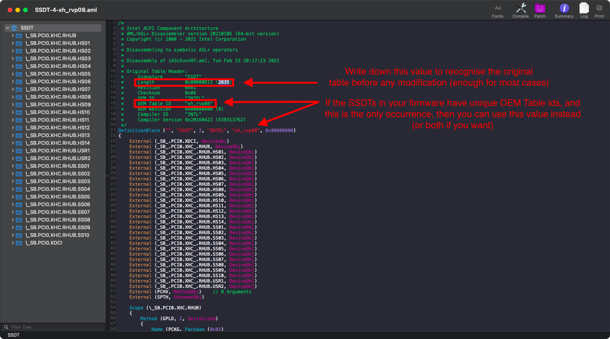
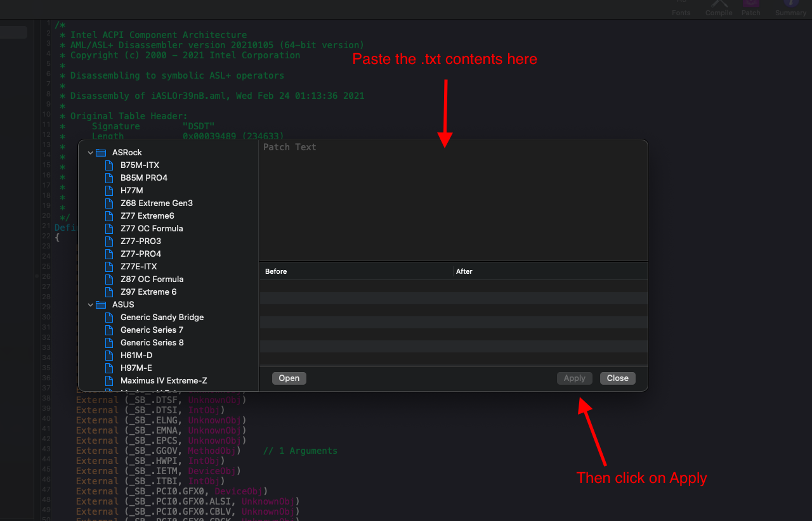
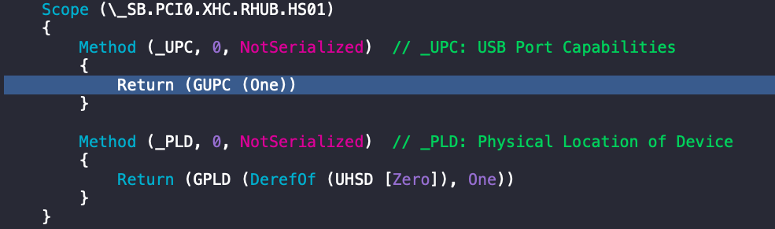
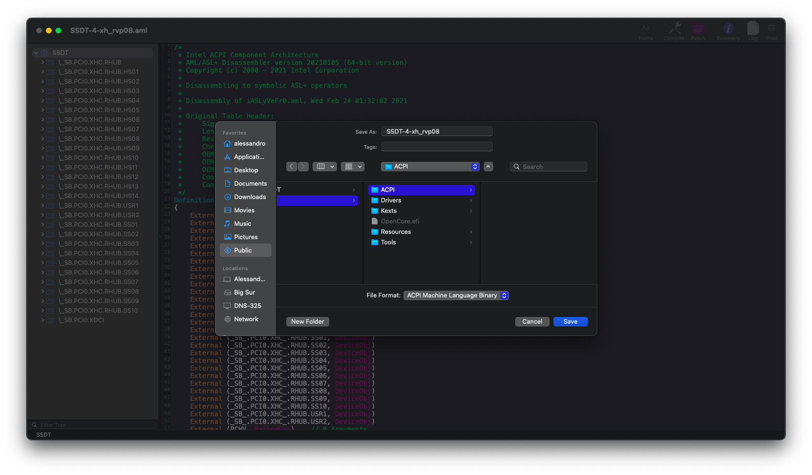
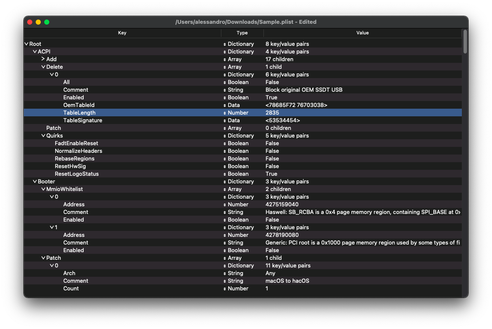

## SSDT method

A little bit of history worth to mention:

* Thanks to [Gengik84](https://www.macos86.it/profile/1-gengik84/) and the [macos86.it community](https://www.macos86.it/topic/9-mappatura-porte-usb/) for developing and testing the `GENG Method`, the original post dates back to 2018.

## Prerequisites:

* Hardware limitations: this guide requires Skylake or newer, AMD is not supported. Also, laptops could be supported but requires to load a custom DSDT which is not recommended by us
* Human limitations: this guide  assumes that the user knows how to use [MaciASL](https://github.com/acidanthera/MaciASL/releases/latest), [IORegistryExplorer](https://github.com/khronokernel/IORegistryClone/blob/master/ioreg-302.zip) and [ProperTree](https://github.com/corpnewt/ProperTree). We'll use a sample motherboard, the ASUS Z370 Prime A II where the USB devices are described in the `SSDT_xh-rvp08.aml`
* Software limitations: OpenCore's `SysReport` feature to look where your OEM put the definitions for your USB devices in the ACPI tables (if none found in the SSDTs, your last chance should be your DSDT but loading a custom DSDT is not recommended by us)


Before any modification, write down the `Length` value which is located in the beginning of the file, as shown: 
 
  

The unmodified, original ACPI table has a lenght of `2835`, this is going to be useful later in the guide, when we're going to tell OpenCore to avoid loading that table in favour of the new one we're going to modify.

## Adding the method to the original SSDT

Let's start by adding the `GENG` method that can be found in MaciASL's Patch menu or this [link](https://github.com/1alessandro1/OpenCore-Post-Install/blob/master/extra-files/UsbConnectorTypePatch.txt) copy all those lines present in the .txt to the clipboard.

Now open MaciASL's `Patch` menu and paste the whole contents of the file to this textbox as shown:



**Note**: At this point, this section assumes that the user already discovered [how to track every single type of port in your system](https://dortania.github.io/OpenCore-Post-Install/usb/manual/manual.html#finding-your-usb-ports) using 2.0 and 3.0 USB devices.

After applying the patch look for the first USB 2.0 personality in your list (from the discovering process explained before).

And we find that the OEM (ASUS) already defined its own `GUPC` method to mark that port as `One` (Enabled) unconditionally, even if that port may not respond to us when tested in IORegistryExplorer.

  
  
  According to the Advanced Configuration and Power Interface (ACPI) Specification, version 6.3, at page [673](https://uefi.org/sites/default/files/resources/ACPI_6_3_May16.pdf#page=673), the `_UPC`  method has these possible values for the `Return` function:

```
Return Value Information:
    Package {
    Connectable // Integer (BYTE)
    Type // Integer (BYTE)
    Reserved0 // Integer
    Reserved1 // Integer)
}
```
Where:

  * `Connectable` is a boolean port which disables/enables the USB port (0/1, respectively)
  * `Type` identifies the shape of the port (e.g. Type-A is rectangular)


## Applying the necessary changes for the discovered ports

* **For USB 2.0 personality ports**: located on the back panel, the Type value is `0x00` or `Zero`:

    ```
    Scope (\_SB.PCI0.XHC.RHUB.HS01) // <-- Your port may differ (in this case is HS01)
    {
        Method (_UPC, 0, NotSerialized)  // _UPC: USB Port Capabilities
        {
            Return (GENG (One, 0x00)) // <-- This is the modification required
        }

        Method (_PLD, 0, NotSerialized)  // _PLD: Physical Location of Device
        {
            Return (GPLD (One, One))
        }
    }
    ```

    Where the first parameter `One` refers to an active port, while `0x00` or `Zero` stands for connector type (2.0 as described in ACPI spec mentioned earlier). 
    

* **USB 3.0 personality ports**: located on the back panel, the Type value is `0x03` (or in some cases `0x07`, usually found on laptops if a battery logo is next to the 3.0 personality USB-A port):   

```
    Scope (\_SB.PCI0.XHC.RHUB.SS01) // <-- Your port may differ (in this case is SS01)
    {
        Method (_UPC, 0, NotSerialized)  // _UPC: USB Port Capabilities
        {
            Return (GENG (One, 0x03)) // <-- This is the modification required
        }

        Method (_PLD, 0, NotSerialized)  // _PLD: Physical Location of Device
        {
            Return (GPLD (DerefOf (USSD [Zero]), One))
        }
    }
```
* **Internal ports**: here port speed does not matter when it comes to editing the `Return` value (an internal 2.0 port is not different from a 3.0 port since it's recognized as an internal "proprietary" connector). Also, the realm of internal ports is vast, and you can't go wrong if you recognize them as non-external ports since you know those are the ones present **only** in the *back panel*, treating every other *active* port as internal. It's worth to mention some of the most recurrent `Internal` ports: 

    * Front panel ports are wired to an internal connector to the motherboard
    * Bluetooth devices are internal USB devices
    * Webcams in laptops  

    Example:

```
    Scope (\_SB.PCI0.XHC.RHUB.HS07) // <-- Your port may differ (in this case is HS07)
    {
        Method (_UPC, 0, NotSerialized)  // _UPC: USB Port Capabilities
        {
            Return (GENG (One, 0xFF)) // <-- This is the modification required
        }

        Method (_PLD, 0, NotSerialized)  // _PLD: Physical Location of Device
        {
            Return (GPLD (DerefOf (UHSD [0x06]), 0x07))
        }
    }
```

* **Inactive ports**: for every other USB port which couldn't be found in the discovery process in IORegistryExplorer, you can return `GENG (Zero, Zero)` to disable a 2.0 port or keep the same method with `GUPC (Zero)`. In this case, if the port is disabled, the connector type is ignored - but the `Return` function must have two arguments, otherwise the compiler returns an error.

    * First approach *(always correct, because the GENG method has already been defined)*:
    ```
        Scope (\_SB.PCI0.XHC.RHUB.SS02) // <-- Your port may differ (in this case is SS02)
        {
            Method (_UPC, 0, NotSerialized)  // _UPC: USB Port Capabilities
            {
                Return (GENG (Zero, 0x03)) // <-- This is the modification required if you want to use the GENG method to disable a 3.0 port
            }

            Method (_PLD, 0, NotSerialized)  // _PLD: Physical Location of Device
            {
                Return (GPLD (DerefOf (USSD [Zero]), One))
            }
        }
    ```
    * Second approach *(OEM dependant, only modifies the value in the parenthesis)*:
    ```
        Scope (\_SB.PCI0.XHC.RHUB.SS01) // <-- Your port may differ (in this case is SS01)
        {
            Method (_UPC, 0, NotSerialized)  // _UPC: USB Port Capabilities
            {
                Return (GUPC (Zero)) // <-- If you want to keep your OEM method for disabling the port
            }

            Method (_PLD, 0, NotSerialized)  // _PLD: Physical Location of Device
            {
                Return (GPLD (DerefOf (USSD [Zero]), One))
            }
        }
    ```

Once you've defined every port using these criterias, go to *File > Save As...*



Remember to add this SSDT to both EFI/OC/ACPI and your config.plist under ACPI -> Add.

* **Note: It is required to block the original OEM Table Lenght / OEM Table id to the ACPI -> Block section:**

  Open your config.plist, use the [ProperTree](https://github.com/corpnewt/ProperTree) and you should do these last tweaks:

  * Use the OC snapsphot feature to add the edited USB SSDT name in your `ACPI > Add` section
  * We also have to tell OpenCore to block the unmodified one hardcoded in our ACPI by specifing the table `Lenght` value in `config.plist/ACPI/Block` 
  * The `TableSignature` value has to be filled converting the word `SSDT` from ASCII to hex
  * (Optional) Set your `OemTableid` converting your SSDT table ASCII value (in our case, `xh_rvp08`) to hex



* Note: Some firmware may use the same name (`OemTableId`) for different SSDTs, (e.g. Gigabyte and some MSI boards). This is why we recommend to check the  table `Lenght` value to ensure proper blocking of the correct table and to avoid dropping unwanted ACPI tables, if you found that at least two SSDTs have the same `TableId` value then you cannot use the `OemTableId` field, therefore opting for `TableLength` option in your config.plist


Save the config.plist, and reboot.
